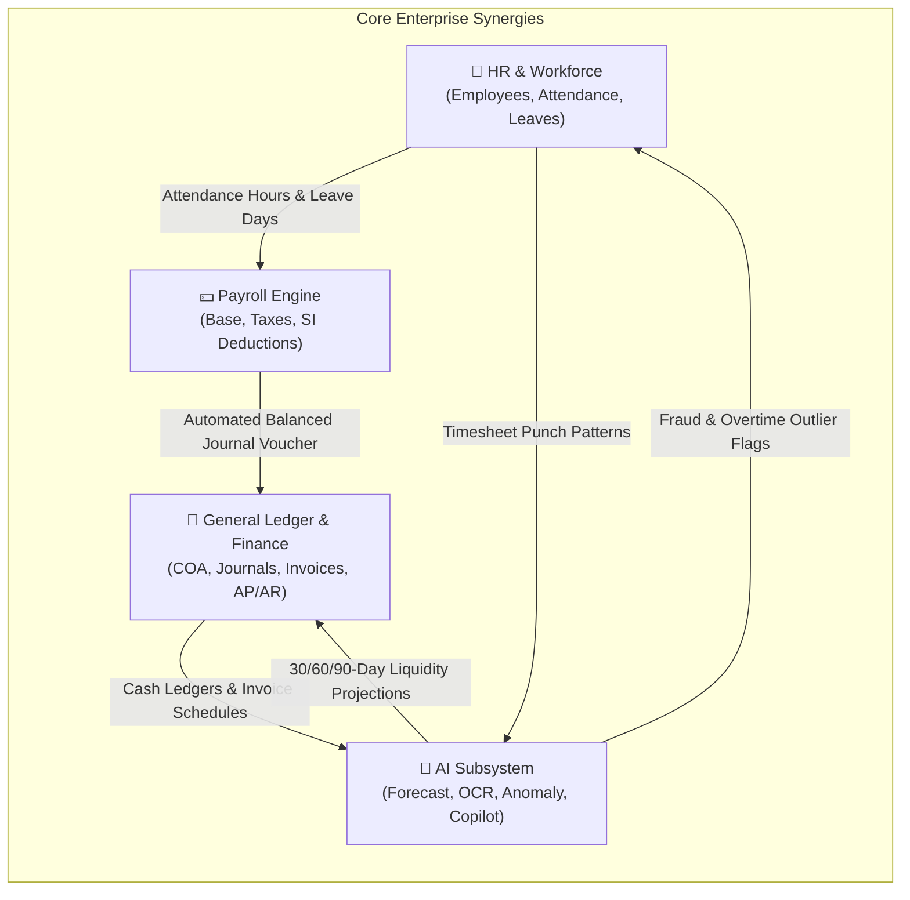
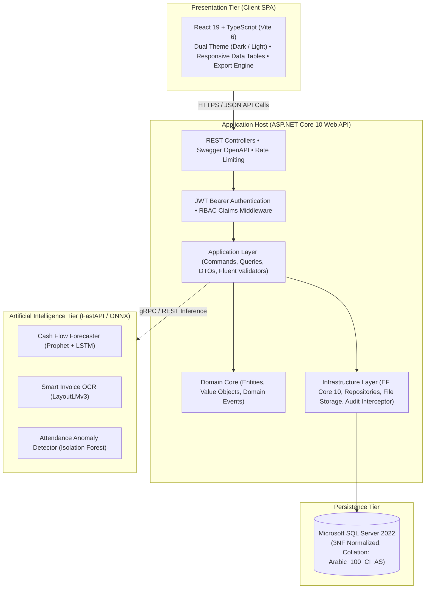

# 🏢 Indigo ERP with AI
### System Analysis & Design Specification (SAD / SDD)
**Next-Generation Accounting, Human Resources & AI-Powered Enterprise Resource Planning Platform**

 

 

**A state-of-the-art, academic and enterprise-grade System Analysis and Design specification for a comprehensive Accounting & HR ERP system augmented by predictive machine learning.**

*Designed with Egyptian statutory tax compliance (14% VAT), Egyptian Labor Law (Law No. 12 of 2003), Egyptian banking integration (CIB, NBE, Banque Misr), and predictive artificial intelligence.*

---

## 📖 Executive Summary & Repository Purpose

This repository houses the complete, authoritative **System Analysis and Design (SAD / SDD)** documentation and architectural blueprints for **Indigo ERP with AI**.

Traditional enterprise software isolates human resource management from financial accounting, forcing organizations to rely on manual spreadsheets, paper memos, and error-prone double-entry bookkeeping. This platform addresses this critical gap by delivering:
1. **The Pivotal HR-to-Finance Bridge:** Approving a monthly payroll cycle instantly calculates progressive Egyptian income taxes and social insurance, generating atomic, balanced General Ledger journal vouchers ($\sum \text{Debit} == \sum \text{Credit}$) without human transcription.
2. **Predictive AI Intelligence:** Integrates machine learning directly into operations — forecasting 30/60/90-day cash flow liquidity, parsing scanned vendor invoices via computer vision OCR, and guarding timesheets with statistical anomaly detection.
3. **Full Egyptian Regulatory Compliance:** Natively implements the **14% Egyptian VAT**, electronic invoicing QR codes, withholding taxes, and labor law leave and overtime rules.

---

## 📚 Complete Technical Documentation Directory

The complete System Analysis & Design specification is organized into **10 comprehensive engineering volumes** plus a master unified specification:

| Volume | Document Name | Description & Core Highlights | Direct Link |
|:---:|:---|:---|:---:|
| 📘 **Master** | **System Analysis & Design Master** | The unified 360-degree specification consolidating all analytical, architectural, and design findings. | [`SYSTEM_ANALYSIS_AND_DESIGN.md`](./docs/SYSTEM_ANALYSIS_AND_DESIGN.md) |
| 📋 **Vol. 01** | **System Analysis Document (SAD)** | As-Is vs. To-Be comparative analysis, TELOS feasibility study, user personas, comprehensive functional requirements (FR-HR, FR-PAY, FR-FIN, FR-AI), NFRs, and Requirements Traceability Matrix (RTM). | [`01_SYSTEM_ANALYSIS.md`](./docs/01_SYSTEM_ANALYSIS.md) |
| 🔄 **Vol. 02** | **Process Modeling & Data Flow Diagrams** | Environmental Context Diagram, DFD Level 0 System Decomposition, DFD Level 1 Subsystem workflows (Payroll-to-GL, Invoicing, AI pipelines), and Data Flow Dictionary. | [`02_PROCESS_MODELING_DFD.md`](./docs/02_PROCESS_MODELING_DFD.md) |
| 🎭 **Vol. 03** | **Use Case Specifications** | System Use Case Diagram, Actor hierarchy, and 10 detailed formal use case specifications with preconditions, sunny day flows, rainy day flows, and business rules. | [`03_USE_CASE_SPECIFICATIONS.md`](./docs/03_USE_CASE_SPECIFICATIONS.md) |
| 🏛️ **Vol. 04** | **System Architecture & Engineering Design** | Clean Architecture / Onion Architecture Modular Monolith, Component Diagram, Enterprise Design Patterns, Polly resilience, and containerized deployment topology. | [`04_SYSTEM_ARCHITECTURE.md`](./docs/04_SYSTEM_ARCHITECTURE.md) |
| 🗄️ **Vol. 05** | **Database Design & ERD Specification** | Third Normal Form (3NF) relational design, Master Mermaid ERD (20+ entities), 6-domain physical data dictionary, composite indexing strategy, and double-entry balance triggers. | [`05_DATABASE_DESIGN_ERD.md`](./docs/05_DATABASE_DESIGN_ERD.md) |
| ⏱️ **Vol. 06** | **UML Sequence & State Machine Diagrams** | 6 dynamic sequence diagrams (Auth/Refresh, Attendance Anomaly, Payroll-to-GL, 14% VAT Invoicing, Receipt OCR, Cash Forecast) and 3 lifecycle state machines. | [`06_UML_SEQUENCE_AND_STATE_DIAGRAMS.md`](./docs/06_UML_SEQUENCE_AND_STATE_DIAGRAMS.md) |
| 🤖 **Vol. 07** | **AI Intelligence Architecture** | Prophet/LSTM additive cash flow forecasting, LayoutLMv3 receipt OCR pipeline, Isolation Forest attendance fraud detector, and read-only Text-to-SQL Copilot. | [`07_AI_INTELLIGENCE_MODULES.md`](./docs/07_AI_INTELLIGENCE_MODULES.md) |
| 🌐 **Vol. 08** | **RESTful API Engineering Specification** | Standardized HTTP contracts, RFC 7807 error envelopes, authentication headers, and comprehensive endpoint catalogs with JSON request/response payloads. | [`08_REST_API_SPECIFICATION.md`](./docs/08_REST_API_SPECIFICATION.md) |
| 🛡️ **Vol. 09** | **Security, Governance & Compliance** | STRIDE threat model, Master 6-Role RBAC permission matrix, immutable EF Core audit interceptor, and Egyptian 14% VAT & Labor Law statutory compliance. | [`09_SECURITY_AND_COMPLIANCE.md`](./docs/09_SECURITY_AND_COMPLIANCE.md) |
| 🎨 **Vol. 10** | **UI/UX Design System Specifications** | High-density enterprise design tokens (Light/Dark themes), typography scales, navigation sitemaps, accessibility standards, and complete 8-screen production screenshot gallery. | [`10_UI_UX_DESIGN_SPECIFICATION.md`](./docs/10_UI_UX_DESIGN_SPECIFICATION.md) |

---

## 🏗️ System Architecture Overview

The system employs a **Clean Architecture / Onion Architecture Modular Monolith** that preserves atomic ACID transactions across the HR and Financial accounting boundary while maintaining decoupled bounded contexts:

---

## 🖼️ Architectural Diagrams Showcase

### 1. Environmental Context Boundary Diagram

  

### 2. DFD Level 0 (System Decomposition & Data Stores)

  

### 3. Master System Use Case Diagram

  

### 4. Simplified Entity Relationship Diagram (ERD)

  

---

## 📸 Production Interface & Screen Gallery

The implemented user interface features rich, high-density enterprise layouts:

| Executive Dashboard | Financial Reports & Analytics |
|:---:|:---:|
|  |  |

| Digital Payslip Modal (Egyptian Taxes) | Enterprise User Management |
|:---:|:---:|
|  |  |

| RBAC Permission Matrix | Regulatory Audit Log Inspector |
|:---:|:---:|
|  |  |

| Organizational & Fiscal Settings | Egyptian Tax Rates & VAT Engine |
|:---:|:---:|
|  |  |

---

## 🏢 Enterprise Organizational & Fiscal Profile

| Organizational Parameter | Specification |
|:---|:---|
| **Organization Entity** | **Enterprise Corporation (S.A.E)** |
| **Legal Status** | Société Anonyme Egyptienne (Egyptian Joint Stock Company) |
| **Headquarters** | Building 12B, Smart Village, KM 28 Cairo-Alexandria Desert Road, Giza, Egypt |
| **Commercial Tax Registration** | `412-985-632` |
| **Operating Currency** | Egyptian Pound (`EGP` / `ج.م`) |
| **Statutory VAT Rate** | **14%** (Law No. 67 of 2016) |
| **Fiscal Year** | January 1 – December 31 |
| **Commercial Banking Partners** | Commercial International Bank (CIB), National Bank of Egypt (NBE), Banque Misr |
| **Corporate Clients** | Vodafone Egypt, Raya IT, Fawry FinTech, Banque Misr Tech Center, Telecom Egypt |
| **Key Vendors** | Telecom Egypt Datacenter, Smart Village Facilities, Tradeline, AXA Egypt |
| **Monthly Payroll Baseline** | Gross: `EGP 401,000.00` \| Net Take-Home: `EGP 336,540.00` |

---

## 🔐 Default Enterprise Test Accounts

The following credentials represent pre-configured persona accounts for testing and evaluation:

| Role | Name | Email | Password | Scope of Authority |
|:---|:---|:---|:---|:---|
| **🛡️ Administrator** | Saif AlDin Ahmed | `admin@indigo.co` | `Admin@123456` | Unrestricted full system access |
| **👥 HR Director** | Ahmed Mansour | `hr@indigo.co` | `Hr@123456` | Workforce, Attendance, Leave & Payroll |
| **💰 Finance Director** | Tarek El-Sayed | `finance@indigo.co` | `Finance@123456` | Financial statements, Invoicing, Tax & AI |
| **📒 Senior Accountant**| Mariam Shenouda | `accountant@indigo.co` | `Accountant@123456` | General Ledger, Journals, AP/AR & Bills |

---

## 🛠️ Technology Stack Breakdown

| Architectural Layer | Technologies Employed |
|:---|:---|
| **Frontend SPA** | React 19, TypeScript, Vite 6, React Router 7, Bootstrap Icons |
| **Styling & Theming** | Custom CSS Design System with CSS Variables, Dark/Light Themes |
| **Backend API** | ASP.NET Core 10 Web API, C# 13, RESTful JSON Architecture |
| **Data Access & ORM** | Entity Framework Core 10 (Code-First, Migrations, Interceptors) |
| **Database** | Microsoft SQL Server 2022+ / Azure SQL Database |
| **Security & Auth** | ASP.NET Core Identity, JWT Bearer Tokens, RBAC Claims |
| **AI Subsystem** | Python 3.12, FastAPI, ONNX Runtime, Prophet, LayoutLMv3, Scikit-Learn |
| **Testing & Quality** | Playwright E2E Suite, xUnit, Automated Integration Checks |
| **Version Control** | Git + GitHub |

---

## 📄 License & Attribution

This specification is published under the [MIT License](LICENSE).  
Developed for academic excellence and enterprise deployment at **Enterprise ERP System**.

---

**[Saifahmed3993/ERP-System-with-AI](https://github.com/Saifahmed3993/ERP-System-with-AI)**  
*Building 12B, Smart Village, KM 28 Cairo-Alex Desert Road, Giza, Egypt*  
© 2026 Enterprise ERP with AI. All rights reserved.

