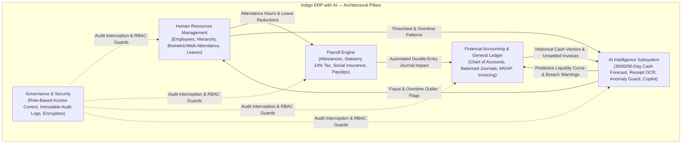
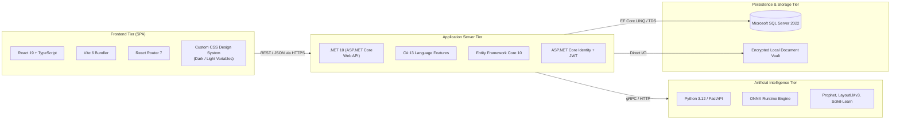
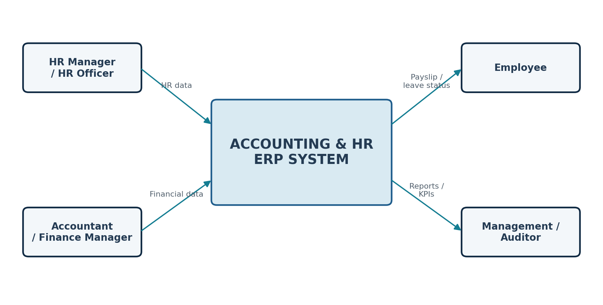
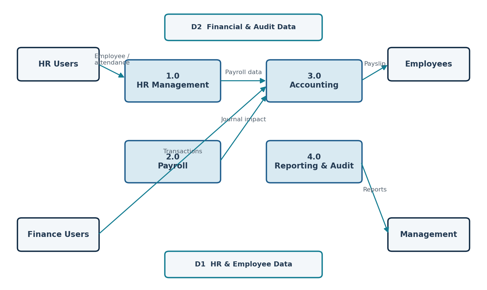
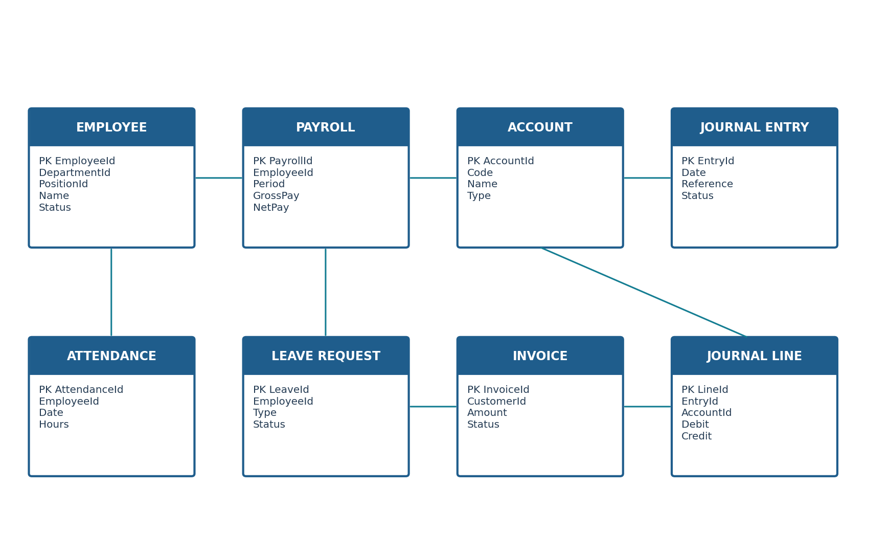
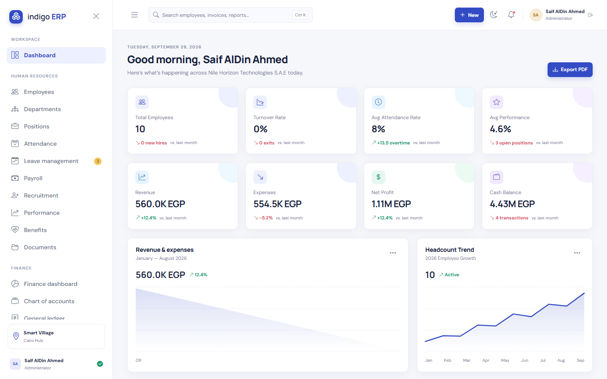
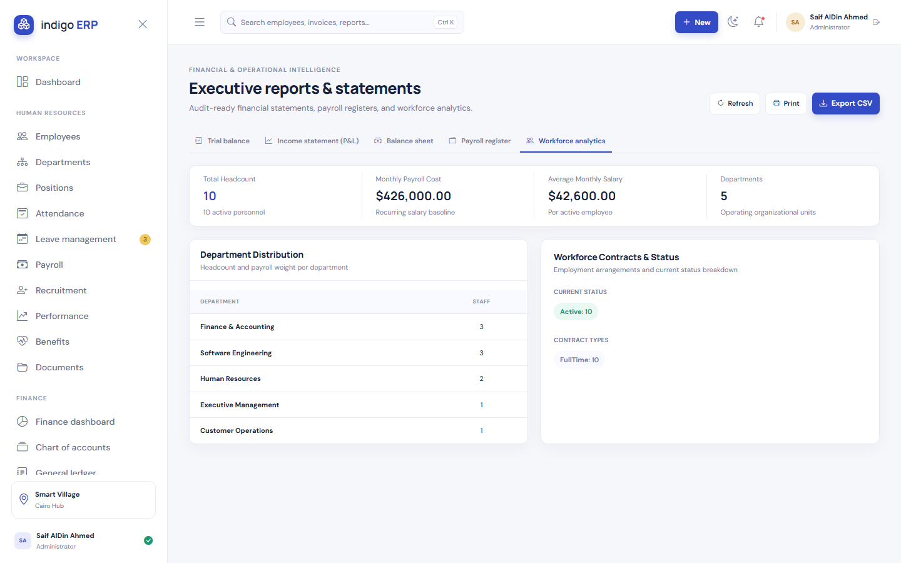
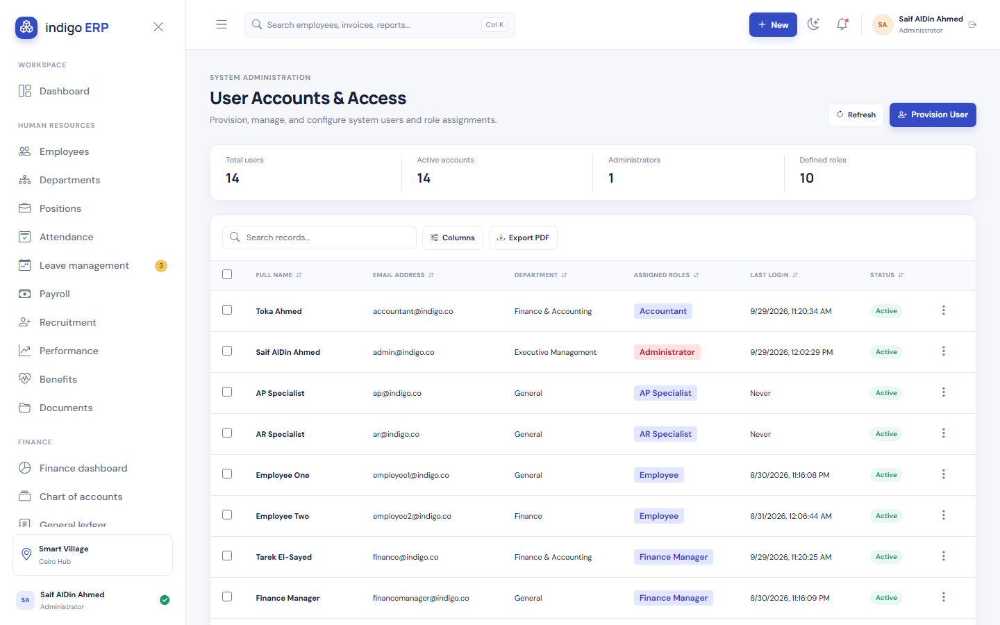
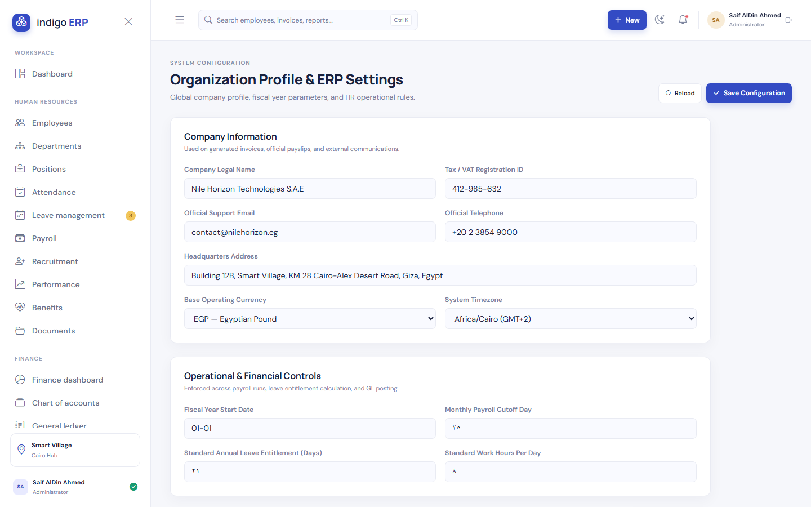

# 📘 Indigo ERP with AI — System Analysis and Design Document (SADD)
## Complete Architectural, Analytical & Engineering Specification
### Enterprise Client: Nile Horizon Technologies S.A.E (نايل هورايزون للحلول التكنولوجية ش.م.م)
**Repository:** [Saifahmed3993/ERP-System-with-AI](https://github.com/Saifahmed3993/ERP-System-with-AI)  
**Document Code:** NHT-SADD-2026-V2  
**Publication Date:** October 2026  
**Document Version:** 2.0.0 (Master Unified Edition)

---

## 🏛️ Executive Document Overview

This document represents the definitive **System Analysis and Design Document (SADD)** for **Indigo ERP with AI** — a next-generation Enterprise Resource Planning platform engineered to bridge **Human Resources (HR)** and **Accounting & Financial Operations** into a unified, auditable, and AI-augmented ecosystem.

Built to comply natively with Egyptian corporate regulations — including the **14% Egyptian Value Added Tax (VAT)**, **Egyptian Labor Law No. 12 of 2003**, and commercial banking integrations (CIB, National Bank of Egypt, Banque Misr) — the platform transforms manual, fragmented spreadsheet operations into an automated, single-source-of-truth enterprise architecture.

---

## 📑 Complete Document Directory & Module Specifications

For deep-dive technical reviews, this specification is decomposed into ten dedicated technical volumes:

| Volume | Title | Focus & Core Artifacts | Direct Link |
|:---:|:---|:---|:---:|
| **Vol. 01** | **System Analysis Document (SAD)** | Problem statement (As-Is vs. To-Be), TELOS feasibility study, user personas, comprehensive functional requirements (FR-HR, FR-PAY, FR-FIN, FR-AI), NFRs, and Requirements Traceability Matrix (RTM). | [Read Vol. 01](01_SYSTEM_ANALYSIS.md) |
| **Vol. 02** | **Process Modeling & Data Flow Diagrams** | Environmental Context Diagram, DFD Level 0 System Decomposition, DFD Level 1 Subsystem workflows (Payroll-to-GL, Invoicing, AI pipelines), and Data Flow Dictionary. | [Read Vol. 02](02_PROCESS_MODELING_DFD.md) |
| **Vol. 03** | **Use Case Specifications** | System Use Case Diagram, Actor hierarchy, and 10 detailed formal use cases with preconditions, postconditions, sunny day flows, rainy day flows, and business rules. | [Read Vol. 03](03_USE_CASE_SPECIFICATIONS.md) |
| **Vol. 04** | **System Architecture & Engineering Design** | Clean Architecture / Onion Architecture Modular Monolith, Component Diagram, Enterprise Design Patterns, Polly resilience, and containerized deployment topology. | [Read Vol. 04](04_SYSTEM_ARCHITECTURE.md) |
| **Vol. 05** | **Database Design & ERD Specification** | Third Normal Form (3NF) relational design, Master Mermaid ERD (20+ entities), 6-domain physical data dictionary, composite indexing strategy, and double-entry balance triggers. | [Read Vol. 05](05_DATABASE_DESIGN_ERD.md) |
| **Vol. 06** | **UML Sequence & State Machine Diagrams** | 6 dynamic sequence diagrams (Auth/Refresh, Attendance Anomaly, Payroll-to-GL, 14% VAT Invoicing, Receipt OCR, Cash Forecast) and 3 lifecycle state machines. | [Read Vol. 06](06_UML_SEQUENCE_AND_STATE_DIAGRAMS.md) |
| **Vol. 07** | **AI Intelligence Architecture** | Prophet/LSTM additive cash flow forecasting, LayoutLMv3 receipt OCR pipeline, Isolation Forest attendance fraud detector, and read-only Text-to-SQL Copilot. | [Read Vol. 07](07_AI_INTELLIGENCE_MODULES.md) |
| **Vol. 08** | **RESTful API Engineering Specification** | Standardized HTTP contracts, RFC 7807 error envelopes, authentication headers, and comprehensive endpoint catalogs with JSON request/response payloads. | [Read Vol. 08](08_REST_API_SPECIFICATION.md) |
| **Vol. 09** | **Security, Governance & Compliance** | STRIDE threat model, Master 6-Role RBAC permission matrix, immutable EF Core audit interceptor, and Egyptian 14% VAT & Labor Law statutory compliance. | [Read Vol. 09](09_SECURITY_AND_COMPLIANCE.md) |
| **Vol. 10** | **UI/UX Design System & Interface Specifications** | High-density enterprise design tokens (Light/Dark themes), typography scales, navigation sitemaps, accessibility standards, and complete 8-screen production screenshot gallery. | [Read Vol. 10](10_UI_UX_DESIGN_SPECIFICATION.md) |

---

## 🏢 Enterprise Case Study Profile: Nile Horizon Technologies S.A.E

| Organizational Parameter | Verified Corporate Specification |
|:---|:---|
| **Legal Entity Name** | **Nile Horizon Technologies S.A.E (نايل هورايزون للحلول التكنولوجية ش.م.م)** |
| **Corporate Structure** | Société Anonyme Egyptienne (Egyptian Joint Stock Company) |
| **Headquarters** | Building 12B, Smart Village, KM 28 Cairo-Alexandria Desert Road, Giza, Egypt |
| **Commercial Tax Registration** | `412-985-632` |
| **Functional Base Currency** | Egyptian Pound (`EGP` / `ج.م`) |
| **Applicable Statutory VAT Rate**| **14%** (Law No. 67 of 2016) |
| **Fiscal Year** | January 1 – December 31 |
| **Primary Banking Partners** | Commercial International Bank (CIB), National Bank of Egypt (NBE), Banque Misr |
| **Enterprise Workforce** | Multi-departmental engineering, sales, HR, and finance workforce |
| **Monthly Payroll Baseline** | Gross: `EGP 401,000.00` \| Net Take-Home: `EGP 336,540.00` |

---

## 🛠️ Unified Technology Stack Specification

---

## 🖼️ Architectural Diagrams & Models Showcase

### 1. Environmental Context Diagram (Level 0 Boundary)

### 2. DFD Level 0 (Core Subsystems & Data Stores)

### 3. Master Use Case Diagram

### 4. Simplified Entity Relationship Diagram (ERD)

---

## 📸 Production Interface & Screen Walkthroughs

The system is fully realized with an enterprise-grade user interface:

### 1. Executive Operations Dashboard
Real-time liquidity metrics, workforce attendance rate, revenue vs. expense trends, and operational quick action cards:

### 2. Financial Reports & Analytics Hub
Trial balance, Profit & Loss statement, Egyptian 14% VAT return generator, and drilldown General Ledger audit statements:

### 3. Confidential Digital Payslip Modal
Individual employee compensation slip displaying Egyptian progressive income tax withholdings, social insurance splits, allowances, and net EGP disbursement:

### 4. Enterprise User Management
Identity directory with real-time status toggles, linked employee profiles, and assigned role badges:

### 5. Role-Based Access Control (RBAC) Matrix
Granular permission assignment grid across all system operations (Administrator, HR Director, Finance Director, Senior Accountant):

### 6. Regulatory Audit Trail Log Viewer
Immutable log repository tracking user actions, before/after JSON diffs, timestamps, and client IP addresses:

### 7. Organizational & Fiscal Settings
Enterprise profile configuration panel (Nile Horizon Technologies S.A.E), commercial registration, tax IDs, fiscal calendar, and storage paths:

### 8. Egyptian Tax Rates & VAT Configuration
Statutory tax engine interface maintaining Egyptian 14% Value Added Tax (VAT), withholding tax brackets, and social insurance contribution ceilings:

---

## 🔐 Default Enterprise Testing Credentials

For authorized quality assurance and technical evaluation, the system seeds pre-configured enterprise accounts corresponding to primary organizational personas:

| Role | Person Name | Email | Password | Scope of Authority |
|:---|:---|:---|:---|:---|
| **🛡️ Administrator** | Saif AlDin Ahmed | `admin@indigo.co` | `Admin@123456` | Unrestricted full system access |
| **👥 HR Director** | Ahmed Mansour | `hr@indigo.co` | `Hr@123456` | Workforce, Attendance, Leave & Payroll |
| **💰 Finance Director** | Tarek El-Sayed | `finance@indigo.co` | `Finance@123456` | Financial statements, Invoicing, Tax & AI |
| **📒 Senior Accountant**| Mariam Shenouda | `accountant@indigo.co` | `Accountant@123456` | General Ledger, Journals, AP/AR & Bills |

---

## 🏁 Architectural Conclusion

The **Indigo ERP with AI** System Analysis and Design specification establishes a robust engineering foundation that bridges the operational divide between Human Resources and Financial Accounting. By coupling rigorous relational ACID transactional controls with cutting-edge artificial intelligence for predictive cash forecasting, automated invoice OCR, and attendance anomaly detection, the platform delivers unparalleled governance, operational velocity, and statutory compliance for Egyptian enterprise excellence.

---
*Official Technical Specification of Nile Horizon Technologies S.A.E — All Rights Reserved © 2026*
