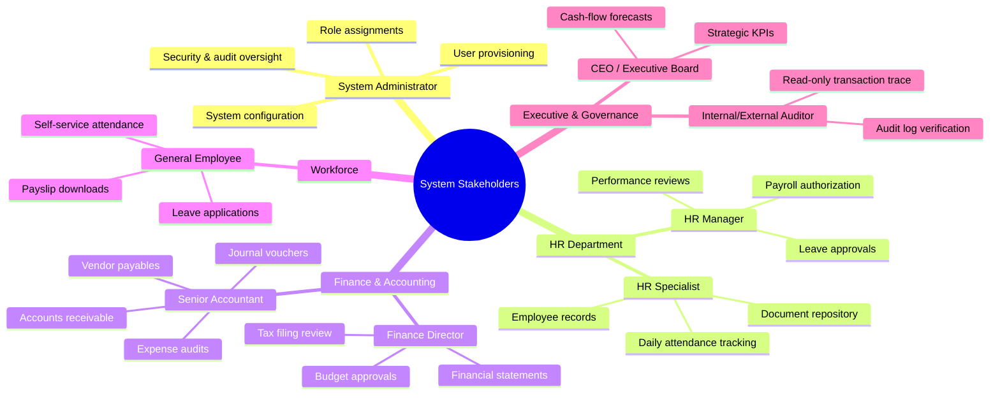
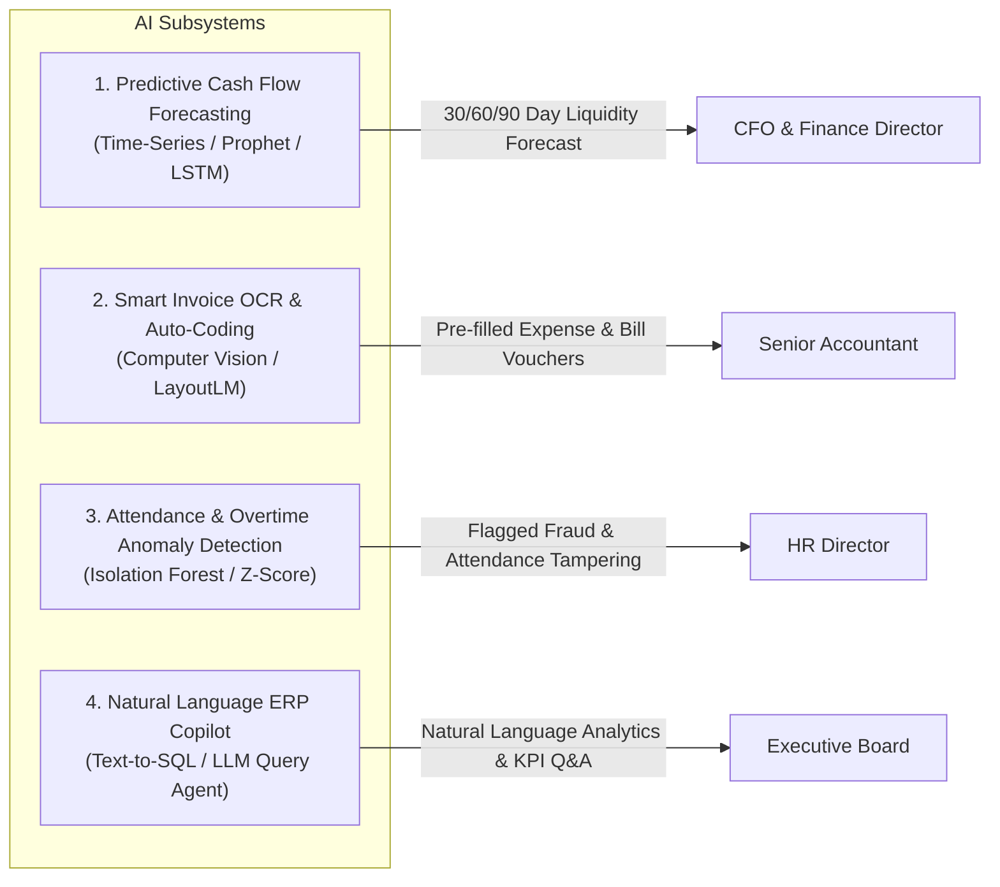
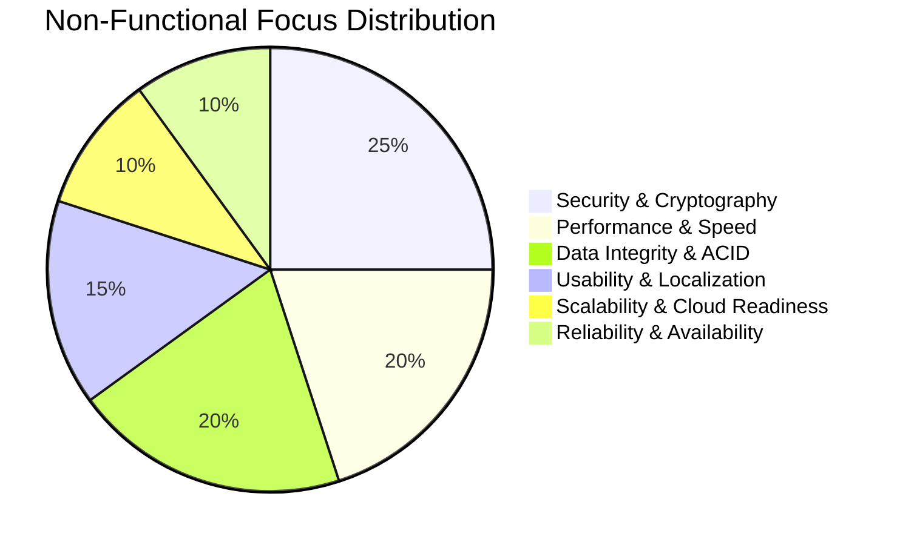

# 📋 System Analysis Document (SAD)
## Next-Generation AI-Enhanced Accounting & HR Enterprise Resource Planning (ERP) System
### Enterprise Client: Nile Horizon Technologies S.A.E (نايل هورايزون للحلول التكنولوجية ش.م.م)
**Project Repository:** [Saifahmed3993/ERP-System-with-AI](https://github.com/Saifahmed3993/ERP-System-with-AI)  
**Version:** 2.0.0 — Comprehensive Engineering Specification  
**Document Classification:** System Analysis & Requirements Engineering

---

## Table of Contents
1. [Executive Summary](#1-executive-summary)
2. [Problem Statement & As-Is System Analysis](#2-problem-statement--as-is-system-analysis)
3. [Proposed System Vision & To-Be Architecture](#3-proposed-system-vision--to-be-architecture)
4. [Feasibility Study (TELOS Framework)](#4-feasibility-study-telos-framework)
5. [Stakeholder Analysis & User Personas](#5-stakeholder-analysis--user-personas)
6. [Comprehensive Functional Requirements](#6-comprehensive-functional-requirements)
7. [AI-Powered Intelligent Capabilities](#7-ai-powered-intelligent-capabilities)
8. [Non-Functional Requirements (NFRs)](#8-non-functional-requirements-nfrs)
9. [Requirements Traceability Matrix (RTM)](#9-requirements-traceability-matrix-rtm)

---

## 1. Executive Summary

Enterprise Resource Planning (ERP) represents the foundational backbone of organizational efficiency, governance, and financial integrity. In modern corporations, **Human Resources (HR)** and **Accounting & Financial Operations** represent the two most codependent organizational pillars:
- Human capital represents the largest operational expenditure through payroll, benefits, and social security.
- Financial governance requires real-time, auditable, and tax-compliant synchronization of every operational event into the General Ledger.

The **Indigo ERP with AI** platform is engineered to eliminate data silos, automate complex multi-departmental workflows, and supercharge enterprise decision-making with predictive machine learning and natural language intelligence. Built specifically to comply with Egyptian corporate regulations (including the **14% Egyptian VAT Law**, **Egyptian Labor Law No. 12 of 2003**, and commercial banking integrations), the system unifies employee management, biometric/web attendance, leave lifecycle, payroll processing, chart of accounts, double-entry bookkeeping, invoicing, expenditure, and predictive financial forecasting into a single, cohesive ecosystem.

```mermaid
graph TD
    subgraph "Core Enterprise Synergies"
        HR["Human Resources Management<br/>(Employees, Attendance, Leaves)"]
        PAY["Payroll Engine<br/>(Allowances, Deductions, Taxes)"]
        ACC["Financial Accounting<br/>(GL, Journals, Invoicing, Expenses)"]
        AI["AI Intelligence Layer<br/>(Forecasting, OCR, Anomaly Detection)"]
    end

    HR -->|Attendance & Leave Data| PAY
    PAY -->|Automated Journal Entries (Dr/Cr)| ACC
    ACC -->|Cash Flow & Ledger Data| AI
    AI -->|Predictive Cash Insights & Alerts| ACC
    HR -->|Workforce Patterns| AI
    AI -->|Attrition & Anomaly Flags| HR
```

---

## 2. Problem Statement & As-Is System Analysis

### 2.1 Current Operational Deficiencies (As-Is State)
Organizations relying on legacy workflows operate across a fragmented tapestry of Microsoft Excel sheets, paper-based approval slips, disconnected biometric time clocks, and standalone desktop accounting applications. This architecture suffers from severe operational vulnerabilities:

1. **Information Silos & Redundant Entry:**
   - Employee demographic changes in HR spreadsheets are not propagated to finance.
   - Payroll calculations performed in Excel must be manually keyed line-by-line into the general ledger by accountants, introducing severe reconciliation overhead.

2. **Calculation Errors & Regulatory Non-Compliance:**
   - Complex progressive income tax tiers, social insurance caps, and overtime multipliers calculated manually in spreadsheets frequently generate calculation drift and compliance penalties under Egyptian statutory audits.

3. **Latency in Decision Making:**
   - Management reports (Balance Sheet, Profit & Loss, Payroll Registers) require days of manual collation, preventing real-time agility.

4. **Security Vulnerabilities & Audit Blind Spots:**
   - Spreadsheets lack granular field-level permissions, encryption, or tamper-evident audit trails. Any user with file access can alter compensation rates or financial figures without accountability.

5. **Purely Reactive Operations:**
   - Traditional systems only record what has already transpired. They cannot anticipate upcoming cash crunches, detect abnormal attendance tampering, or extract automated insights from incoming vendor receipts.

### 2.2 As-Is vs. To-Be Comparative Matrix

| Operational Dimension | As-Is (Legacy / Spreadsheet Workflow) | To-Be (Indigo ERP with AI) |
|:---|:---|:---|
| **Data Storage** | Fragmented spreadsheets, local `.xlsx` files, email attachments | Centralized Microsoft SQL Server with strict relational integrity |
| **Data Consistency** | High risk of duplicate data and out-of-sync versions | ACID-compliant Single Source of Truth (SSOT) |
| **Payroll to GL Flow** | Manual re-keying of net salary, tax, and social insurance | Instant, atomic automated journal vouchers posted on approval |
| **Attendance Tracking** | Manual export from biometric devices or paper timesheets | Unified web check-in/out with automated work-hour and overtime calculation |
| **Security & Access** | File passwords or open shared network folders | Role-Based Access Control (RBAC) with JWT bearer claims & audit logging |
| **Analytical Capability**| Static backwards-looking reports compiled manually | Real-time interactive dashboards + Predictive AI forecasting models |
| **Document Processing**| Manual transcription of vendor invoices and paper receipts | AI-powered OCR parsing line-items and tax amounts into expense drafts |
| **Egyptian Regulatory Support** | Generic formulas prone to regulatory drift | Native 14% VAT engine, Egyptian tax brackets, and EGP currency support |

---

## 3. Proposed System Vision & To-Be Architecture

The proposed system delivers a cloud-ready, enterprise-grade, modular web application governed by Clean Architecture principles:
- **Presentation Layer:** React 19 SPA running on Vite 6, styled with a modern, responsive design system supporting light/dark themes and localized formatting.
- **Application & Domain Layer:** ASP.NET Core 10 Web API built on C# 13, adhering to Domain-Driven Design (DDD) and Command-Query Separation.
- **Persistence Layer:** Entity Framework Core 10 targeting Microsoft SQL Server, featuring database migrations, shadow audit properties, and soft-delete semantics.
- **AI Intelligence Gateway:** Dedicated machine learning pipeline supporting time-series financial forecasting (Prophet / ARIMA), Computer Vision / OCR invoice extraction, and workforce anomaly clustering.

```mermaid
flowchart LR
    subgraph Clients["Presentation Tier"]
        Admin["Administrator Portal"]
        HRPortal["HR Workspace"]
        FinPortal["Finance Desk"]
        EmpPortal["Employee Self-Service"]
    end

    subgraph Gateway["API & Security Tier"]
        Auth["JWT Auth / RBAC Middleware"]
        Router["RESTful API Gateway"]
        Audit["System Audit Interceptor"]
    end

    subgraph Core["Business Logic Tier"]
        HRService["HR & Attendance Service"]
        PayrollEngine["Payroll Calculation Engine"]
        LedgerService["General Ledger & Journal Service"]
        TaxEngine["14% VAT & Egyptian Tax Engine"]
    end

    subgraph Intelligence["AI Services Tier"]
        ForecastAI["Predictive Cash Flow Model"]
        OCRAI["Smart Invoice OCR Engine"]
        AnomalyAI["Attendance Anomaly Detector"]
    end

    subgraph Storage["Data Tier"]
        DB[("SQL Server (ACID Relational DB)")]
        FileStore["Document & Attachment Vault"]
    end

    Clients --> Gateway
    Gateway --> Core
    Core --> Storage
    Core <--> Intelligence
    Intelligence --> Storage
```



---

## 4. Feasibility Study (TELOS Framework)

### 4.1 Technical Feasibility (T)
- **Framework Maturity:** ASP.NET Core 10 and React 19 represent cutting-edge, long-term supported enterprise frameworks with extensive ecosystem support, type safety (TypeScript & C#), and exceptional runtime performance.
- **Database Scalability:** Microsoft SQL Server reliably scales to millions of transactional rows with sub-millisecond index lookups and clustered columnstore indices for reporting.
- **Hardware Footprint:** Minimal resource overhead; containerized deployment runs efficiently on commodity cloud virtual machines (e.g., Azure App Service, AWS EC2, or on-premise Docker hosts).
- **Verdict:** **Highly Feasible**.

### 4.2 Economic Feasibility (E)
- **Development & Deployment Costs:** Zero runtime software licensing costs for core frameworks (open-source .NET and React ecosystems). SQL Server Express or Standard editions accommodate current and medium-term load.
- **Cost Savings:**
  * **Payroll Processing Time:** Reduced from 4 business days to under 15 minutes per pay cycle (95% time savings).
  * **Invoice Entry Overhead:** Automated OCR extraction eliminates ~80% of data transcription labor.
  * **Calculation Accuracy:** Eradication of payroll calculation errors eliminates regulatory fines and employee compensation disputes.
- **Payback Period:** Estimated at 3.5 months based on operational man-hour savings.
- **Verdict:** **Highly Economically Viable**.

### 4.3 Legal & Regulatory Feasibility (L)
- **Egyptian Tax Authority (ETA) Compliance:** Supports Egyptian e-invoicing standards, unique invoice identifiers, and automatic calculation of the standard **14% Value Added Tax (VAT)** and withholding taxes (*خصم وتحصيل تحت حساب الضريبة*).
- **Labor Law No. 12 of 2003:** Encodes legal annual leave entitlements (21 days standard, 30 days for 10+ years tenure or age 50+), official paid holidays, and overtime compensation rates.
- **Data Protection & Privacy:** User passwords hashed via PBKDF2/Argon2; session management governed by cryptographically signed JWT tokens; sensitive financial records protected by role segregation.
- **Verdict:** **Fully Compliant**.

### 4.4 Operational Feasibility (O)
- **User Experience (UX):** Streamlined user journeys tailored for specific operational personas (e.g., fast check-in for employees, single-click reconciliation for accountants).
- **Change Management:** Features intuitive table filtering, search, multi-column sorting, Excel export, and printable vouchers that mirror familiar physical accounting documentation.
- **Training Curve:** Clean, self-documenting interface enables administrative staff to reach operational proficiency in under 3 hours of onboarding.
- **Verdict:** **Highly Feasible**.

### 4.5 Schedule Feasibility (S)
The project execution is organized into 5 phased development sprints:
1. **Sprint 1 (Weeks 1-3):** Foundation, Identity, RBAC, Database Architecture, and Master Data Setup.
2. **Sprint 2 (Weeks 4-6):** Core HR Lifecycle (Employees, Departments, Attendance, Leaves).
3. **Sprint 3 (Weeks 7-9):** Payroll Calculation Engine and Payslip Disbursement.
4. **Sprint 4 (Weeks 10-12):** Financial Accounting (Chart of Accounts, Journals, Invoicing, AP/AR, Tax).
5. **Sprint 5 (Weeks 13-14):** HR-to-GL Integration, AI Services, E2E Testing, and Production Hardening.
- **Verdict:** **Realistic and Achievable**.

---

## 5. Stakeholder Analysis & User Personas



### Key Personas Overview

1. **Saif AlDin Ahmed — System Administrator**
   - *Primary Goal:* Maintain platform reliability, manage identity lifecycles, configure global organizational settings, and monitor security audit logs.
   - *Key Needs:* Intuitive RBAC management, active session revocation, database health metrics.

2. **Ahmed Mansour — HR Director**
   - *Primary Goal:* Supervise employee lifecycles, enforce leave policies, verify monthly timesheets, and approve monthly payroll disbursements.
   - *Key Needs:* One-click leave approvals, automated overtime summaries, discrepancy alerts.

3. **Tarek El-Sayed — Finance Director**
   - *Primary Goal:* Oversee organizational liquidity, monitor cash flows, verify fiscal compliance, and inspect financial statements.
   - *Key Needs:* High-level executive dashboards, predictive cash flow projections, budget vs. actual analytics.

4. **Mariam Shenouda — Senior Accountant**
   - *Primary Goal:* Accurately record journal entries, manage customer invoices, track supplier payables, and reconcile monthly bank accounts.
   - *Key Needs:* Fast numeric entry, automated debit/credit balancing, seamless Excel export, instant PDF printouts.

5. **Karim Farouk — Enterprise Employee**
   - *Primary Goal:* Record daily attendance, apply for annual leave, view approved leaves, and review monthly payslips privately.
   - *Key Needs:* Clean mobile-friendly UI, immediate notification of leave decisions, confidential payslip viewing.

---

## 6. Comprehensive Functional Requirements

### 6.1 Human Resources & Workforce Management (FR-HR)

| Requirement ID | Requirement Name | Description | Priority |
|:---|:---|:---|:---:|
| **FR-HR-01** | Employee Master Management | System shall allow authorized HR staff to create, update, deactivate, and view employee profiles (Personal details, National ID, Department, Position, Hire Date, Salary, Status). | **High** |
| **FR-HR-02** | Department & Position Hierarchy | System shall maintain hierarchical organizational units (Departments) and job positions with defined salary grades and managerial relationships. | **High** |
| **FR-HR-03** | Attendance Logging & Tracking | System shall capture daily employee check-in and check-out timestamps, calculating total daily hours, overtime hours, and late-arrival minutes. | **High** |
| **FR-HR-04** | Leave Application & Workflow | System shall allow employees to submit leave requests (Annual, Sick, Unpaid, Casual). Requests shall route to the HR Manager for approval or rejection with notes. | **High** |
| **FR-HR-05** | Leave Balance Entitlement | System shall automatically enforce annual leave quotas, deducting days upon approval and preventing negative balances without managerial override. | **High** |
| **FR-HR-06** | HR Document Repository | System shall securely store employee files (contracts, ID scans, certificates, medical records) with file type validation, size limits (10MB), and expiration alerts. | **Medium** |
| **FR-HR-07** | Recruitment & Applicant Tracking | System shall manage open job postings and candidate pipelines through recruitment stages (Applied, Screened, Interviewed, Offered, Hired). | **Medium** |
| **FR-HR-08** | Performance Evaluation | System shall track employee appraisal cycles, KPI scorecards, reviewer comments, and performance ratings. | **Low** |

### 6.2 Payroll Processing & Compensation (FR-PAY)

| Requirement ID | Requirement Name | Description | Priority |
|:---|:---|:---|:---:|
| **FR-PAY-01** | Automated Payroll Calculation | System shall calculate monthly payroll by aggregating base salary, position allowances, approved overtime pay, deducting unpaid absences, and applying statutory deductions. | **High** |
| **FR-PAY-02** | Egyptian Statutory Deductions | System shall compute Egyptian Social Insurance employee/employer shares and calculate progressive income tax brackets compliant with current tax law. | **High** |
| **FR-PAY-03** | Payroll Approval & Locking | System shall enforce a formal review-and-approval lifecycle (Draft -> Calculated -> Approved -> Paid). Approved payroll cycles must be immutable. | **High** |
| **FR-PAY-04** | Digital Payslip Generation | System shall generate confidential, branded digital payslips showing detailed breakdowns (Gross, Base, Allowances, Deductions, Net Pay) exportable to PDF. | **High** |
| **FR-PAY-05** | HR-to-Finance GL Synchronization | Upon payroll approval, the system shall automatically generate balanced General Ledger journal entries debiting Salary Expense and crediting Cash/Bank and Withholding liabilities. | **Critical** |

### 6.3 Financial Accounting & Ledger (FR-FIN)

| Requirement ID | Requirement Name | Description | Priority |
|:---|:---|:---|:---:|
| **FR-FIN-01** | Chart of Accounts (COA) | System shall support a multi-level Chart of Accounts categorized by standard accounting classes: Assets (1000), Liabilities (2000), Equity (3000), Revenue (4000), Expenses (5000). | **High** |
| **FR-FIN-02** | Double-Entry Journal Entries | System shall allow creation of journal vouchers where total debits must strictly equal total credits ($\sum \text{Debit} = \sum \text{Credit}$) before posting. | **Critical** |
| **FR-FIN-03** | General Ledger & Trial Balance | System shall aggregate posted transactions into real-time Account Ledgers, Trial Balance, Income Statement (P&L), and Balance Sheet. | **High** |
| **FR-FIN-04** | Customer Invoicing (Accounts Receivable)| System shall generate sales invoices for customers with line items, quantity, unit price, discounts, and automatic 14% Egyptian VAT calculation. | **High** |
| **FR-FIN-05** | Vendor Billing (Accounts Payable) | System shall record supplier bills, track due dates, manage outstanding liabilities, and prevent duplicate vendor invoice numbers. | **High** |
| **FR-FIN-06** | Expense Voucher Management | System shall capture operational expenses with category classification, vendor linking, supporting receipt attachments, and approval workflows. | **High** |
| **FR-FIN-07** | Multi-Bank Payment Processing | System shall record cash and bank payments/receipts across dedicated bank accounts (CIB, NBE, Banque Misr, Cash Safe) with automatic ledger reconciliation. | **High** |
| **FR-FIN-08** | Budgeting & Variance Analysis | System shall allow setting departmental annual/quarterly budgets and display real-time variance analysis (Budget vs. Actual Spend). | **Medium** |
| **FR-FIN-09** | Egyptian Tax Management | System shall maintain dynamic tax rates (Standard 14% VAT, 1% WHT, etc.) and generate VAT return summary reports ready for official filing. | **High** |

### 6.4 Security, Governance & Administration (FR-SEC)

| Requirement ID | Requirement Name | Description | Priority |
|:---|:---|:---|:---:|
| **FR-SEC-01** | Secure Authentication | System shall authenticate users via email and cryptographically hashed passwords, issuing short-lived JWT tokens and rolling refresh tokens. | **Critical** |
| **FR-SEC-02** | Role-Based Access Control (RBAC) | System shall enforce granular permissions per role (Administrator, HR Manager, Finance Manager, Accountant, Employee, Auditor) at both API and UI layers. | **Critical** |
| **FR-SEC-03** | Tamper-Evident Audit Logging | System shall log every sensitive state change (Entity, Record ID, Action, Timestamp, User ID, Client IP, Before/After Snapshot) in an append-only audit table. | **High** |
| **FR-SEC-04** | System Configuration & Seeding | System shall provide administrative interfaces for global company profile, fiscal year definitions, currency symbols (EGP), and test data seeding. | **Medium** |

---

## 7. AI-Powered Intelligent Capabilities

Modern enterprise ERPs must transition from passive recording systems to active intelligence partners. **Indigo ERP with AI** introduces four machine-learning capabilities designed for operational and financial optimization:



### 7.1 FR-AI-01: Predictive Cash Flow Forecasting
- **Mechanism:** Ingests historical daily receipts, upcoming customer invoice due dates, vendor payment schedules, and recurring monthly payroll obligations.
- **Model:** Hybrid Time-Series model (Prophet / ARIMA with seasonal decomposition).
- **Output:** 30-day, 60-day, and 90-day cash position forecasts with upper and lower 95% confidence intervals, alerting the CFO 3 weeks in advance of potential liquidity deficits.

### 7.2 FR-AI-02: Intelligent Invoice & Receipt OCR
- **Mechanism:** When a user uploads a PDF or scanned image of a vendor invoice or expense receipt, an OCR computer vision pipeline extracts key metadata.
- **Extracted Fields:** Vendor Name, Tax ID Number, Invoice Number, Date, Total Amount, 14% VAT Amount, and individual Line Items.
- **Smart Coding:** Automatically suggests the appropriate General Ledger Expense Account (e.g., matching "AWS Cloud Services" to Account `5030 - IT & Hosting Infrastructure`).

### 7.3 FR-AI-03: Attendance Anomaly & Overtime Outlier Detection
- **Mechanism:** Unsupervised anomaly detection algorithm (Isolation Forest) continually monitors attendance check-in/out stamps and overtime claims.
- **Flags:**
  * Impossible transit speeds between check-ins.
  * Suspicious cluster check-ins occurring within seconds from identical client IPs.
  * Overtime hours exceeding 3 standard deviations ($\sigma > 3$) from historical role averages.

### 7.4 FR-AI-04: Natural Language ERP Copilot (Text-to-SQL / NLQ)
- **Mechanism:** Embedded enterprise agent allowing non-technical managers to query the ERP database using conversational English or Arabic.
- **Sample Queries:**
  * *"Show me the top 5 highest expenses this quarter compared to budget."*
  * *"ما هي الإدارة الأعلى في معدل الغياب وساعات العمل الإضافي هذا الشهر؟"*
- **Safety Protocol:** Read-only execution sandboxed with parameterized queries; zero direct schema mutation permitted.

---

## 8. Non-Functional Requirements (NFRs)



### 8.1 Performance Requirements
- **NFR-PERF-01:** API response times for standard CRUD transactions shall not exceed **200 milliseconds** under normal load (95th percentile).
- **NFR-PERF-02:** Bulk payroll calculation for up to 1,000 active employees shall complete within **2.5 seconds**.
- **NFR-PERF-03:** Client-side initial page bundle load shall render in under **1.2 seconds** on standard corporate broadband.

### 8.2 Security & Data Protection
- **NFR-SEC-01:** Authentication tokens shall utilize HMAC-SHA256 signed JSON Web Tokens (JWT) with an expiry threshold of **15 minutes** and refresh tokens stored securely in HttpOnly cookies or protected storage.
- **NFR-SEC-02:** Passwords must meet enterprise complexity criteria: minimum 8 characters, containing uppercase, lowercase, numeric digits, and special characters.
- **NFR-SEC-03:** All network traffic between client, API, and background microservices must be encrypted via **TLS 1.3**.
- **NFR-SEC-04:** Data access must prevent SQL Injection through parameterized Entity Framework Core LINQ queries; cross-site scripting (XSS) mitigated through sanitized React DOM rendering.

### 8.3 Availability & Reliability
- **NFR-REL-01:** The system shall maintain an operational availability target of **99.9% uptime** during standard business hours (8:00 AM – 8:00 PM EET).
- **NFR-REL-02:** Automated database transaction logs and backups shall support a Recovery Point Objective (RPO) of **< 15 minutes** and a Recovery Time Objective (RTO) of **< 1 hour**.

### 8.4 Usability, Accessibility & Localization
- **NFR-USE-01:** The user interface must support responsive layouts adapting to desktop monitors ($1920 \times 1080$), laptops ($1366 \times 768$), and tablets ($768 \times 1024$).
- **NFR-USE-02:** The system shall support both **Dark Mode** and **Light Mode** visual themes, persisting user preferences locally.
- **NFR-USE-03:** System reports and number formatters must natively format currency as **Egyptian Pounds (EGP / ج.م)** using standard decimal conventions.

---

## 9. Requirements Traceability Matrix (RTM)

The following matrix links foundational business drivers to system requirements, architectural components, and verification methods:

| Business Need | Requirement ID | Functional Scope | Architectural Component | Verification Method |
|:---|:---|:---|:---|:---|
| **Eliminate payroll errors** | `FR-PAY-01` | Automated gross-to-net calculation | `PayrollCalculationEngine` | Unit tests & manual verification |
| **Egyptian tax compliance** | `FR-PAY-02`, `FR-FIN-09` | 14% VAT & progressive income tax | `EgyptianTaxService` | Automated tax calculator tests |
| **Prevent manual GL entry** | `FR-PAY-05` | Auto-journal posting from payroll | `PayrollPostingService` | E2E Integration test |
| **Balanced ledger enforcement** | `FR-FIN-02` | Double-entry validation ($\sum Dr = \sum Cr$) | `JournalEntryValidator` | Database transaction assertions |
| **Liquidity risk mitigation** | `FR-AI-01` | 30/60/90-day cash flow forecast | `AiCashForecastService` | Historical backtesting metrics |
| **Accelerate bill processing** | `FR-AI-02` | OCR invoice line-item extraction | `AiOcrInferenceClient` | Sample receipt parsing validation |
| **Strict access governance** | `FR-SEC-01`, `FR-SEC-02` | Role-based permission enforcement | `JwtAuthorizationFilter` | Security penetration tests |
| **Regulatory audit compliance**| `FR-SEC-03` | Immutable change audit logging | `AuditLogInterceptor` | Audit log verification tests |

---
*End of System Analysis Document (SAD) — Continued in System Design Document (SDD)*
