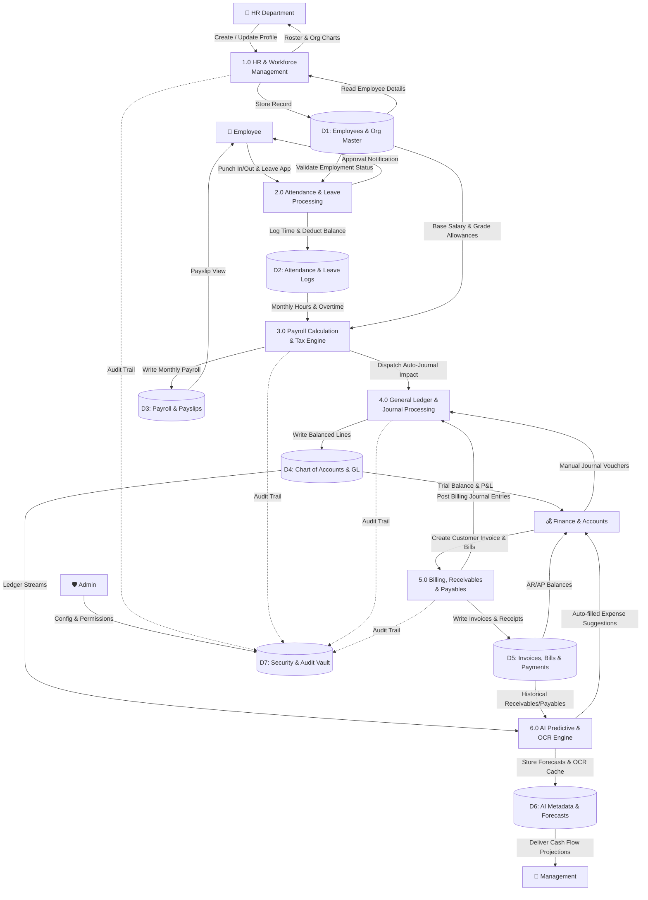
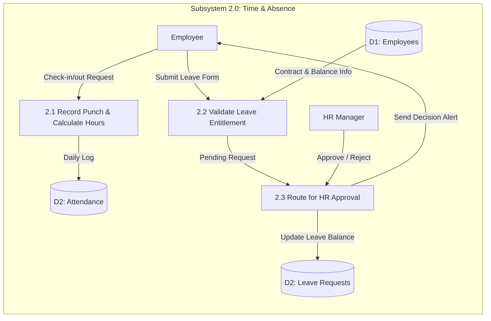
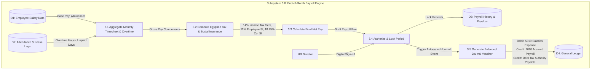
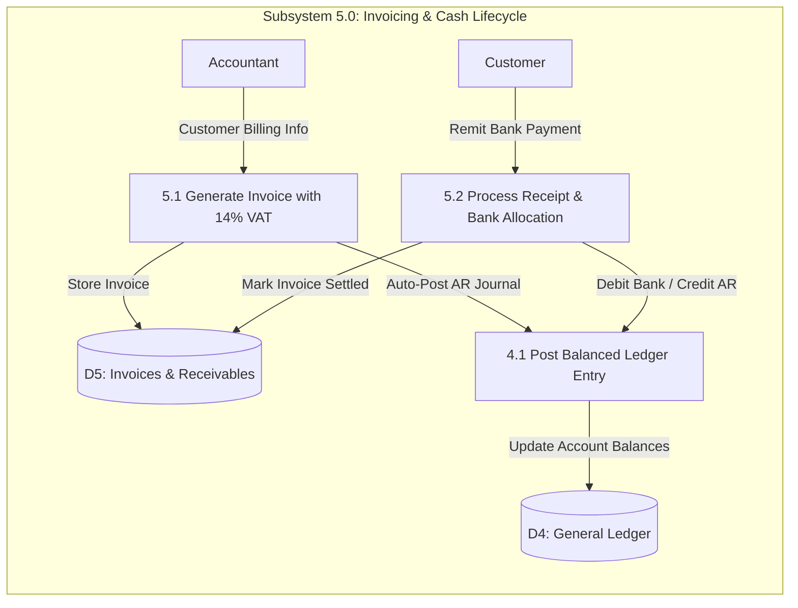

# 🔄 Process Modeling & Data Flow Diagrams (DFD)
## Structured Process Specifications for Indigo ERP with AI
### Enterprise Client: Nile Horizon Technologies S.A.E
**Project Repository:** [Saifahmed3993/ERP-System-with-AI](https://github.com/Saifahmed3993/ERP-System-with-AI)  
**Version:** 2.0.0 — Comprehensive Process Architecture

---

## Table of Contents
1. [Introduction to Structured Process Modeling](#1-introduction-to-structured-process-modeling)
2. [Context Diagram (DFD Level 0 / Environmental Boundary)](#2-context-diagram-dfd-level-0--environmental-boundary)
3. [DFD Level 0 (System Decomposition)](#3-dfd-level-0-system-decomposition)
4. [DFD Level 1: Subsystem Process Decompositions](#4-dfd-level-1-subsystem-process-decompositions)
   - [4.1 Subsystem 1.0 & 2.0: HR, Attendance & Leave Workflow](#41-subsystem-10--20-hr-attendance--leave-workflow)
   - [4.2 Subsystem 3.0: Payroll Calculation Engine & GL Dispatch](#42-subsystem-30-payroll-calculation-engine--gl-dispatch)
   - [4.3 Subsystem 4.0 & 5.0: Invoicing, Payments & General Ledger](#43-subsystem-40--50-invoicing-payments--general-ledger)
   - [4.4 Subsystem 6.0: AI Intelligence Hub (OCR & Predictive Pipeline)](#44-subsystem-60-ai-intelligence-hub-ocr--predictive-pipeline)
5. [Data Flow Dictionary](#5-data-flow-dictionary)

---

## 1. Introduction to Structured Process Modeling

Data Flow Modeling maps the movement, transformation, and storage of information throughout the enterprise. In **Indigo ERP with AI**, data flows bridge operational actions (such as an employee punching a time-clock or an accountant scanning an invoice) with automated backend accounting equations and predictive artificial intelligence models.

Notation used complies with the standard **Gane & Sarson / Yourdon** methodologies:
- **External Entities (Squares):** External actors, roles, or third-party institutions providing inputs or consuming outputs.
- **Processes (Rounded Rectangles / Circles):** Business logic and algorithms transforming data.
- **Data Stores (Open Rectangles / Cylinders):** ACID-compliant persistent database tables.
- **Data Flows (Arrows):** Directed packets of structured data moving between entities, processes, and stores.

---

## 2. Context Diagram (DFD Level 0 / Environmental Boundary)

The Context Diagram defines the net organizational boundary of the system, isolating internal ERP operations from external actors and partner systems.

### 2.1 Environmental Boundary Diagram

```mermaid
flowchart TD
    %% External Entities
    EMP["👤 Employee"]
    HRM["👥 HR Manager / Specialist"]
    ACT["📒 Senior Accountant"]
    FM["💰 Finance Manager / CFO"]
    ADM["🛡️ System Administrator"]
    ETA["🏛️ Egyptian Tax Authority (ETA)"]
    BNK["🏦 Commercial Banks (CIB / NBE)"]
    AI_EXT["🤖 Cloud AI Inference Services"]

    %% Central Process
    ERP(("🏢 0.0<br/>Indigo ERP<br/>System with AI"))

    %% Data Flows
    EMP -->|Punch Timestamps, Leave Requests| ERP
    ERP -->|Personal Payslips, Leave Balance, Alerts| EMP

    HRM -->|Employee Profiles, Policies, Payroll Approval| ERP
    ERP -->|Attendance Summaries, Attrition Flags, Rosters| HRM

    ACT -->|Journal Entries, Vendor Bills, Customer Invoices| ERP
    ERP -->|Trial Balance, Ledger Statements, Reconciliations| ACT

    FM -->|Budget Approvals, Financial Thresholds| ERP
    ERP -->|Predictive Cash Flow, P&L, Executive KPIs| FM

    ADM -->|User Accounts, Role Grants, System Configurations| ERP
    ERP -->|Audit Logs, System Health, Exception Telemetry| ADM

    ERP -->|14% VAT Filing Data, Withholding Tax Summaries| ETA
    ERP -->|Salary Disbursal Instruction File (ACH / WFPS)| BNK
    BNK -->|Bank Statement Settlement Feed| ERP

    ERP -->|Scanned Receipts, Anonymized Financial Records| AI_EXT
    AI_EXT -->|OCR Structured JSON, Time-Series Predictions| ERP
```

### 2.2 Visual Artifact Reference
The original conceptual model for the context boundary is captured in the system design archive:


---

## 3. DFD Level 0 (System Decomposition)

DFD Level 0 decomposes the core system into six foundational macro-processes and seven primary relational data stores.



### 3.1 Visual Artifact Reference
The primary system decomposition architecture is captured in the archive:


---

## 4. DFD Level 1: Subsystem Process Decompositions

### 4.1 Subsystem 1.0 & 2.0: HR, Attendance & Leave Workflow

This subsystem handles workforce lifecycle events, tracking working hours and enforcing leave policy balances.



### 4.2 Subsystem 3.0: Payroll Calculation Engine & GL Dispatch

The pivotal enterprise integration point occurs when monthly attendance, overtime, bonuses, statutory taxes, and base salaries are aggregated, locked, and converted into balanced General Ledger journals.



### 4.3 Subsystem 4.0 & 5.0: Invoicing, Payments & General Ledger



### 4.4 Subsystem 6.0: AI Intelligence Hub (OCR & Predictive Pipeline)

```mermaid
flowchart TD
    subgraph "Subsystem 6.0: AI Processing Pipeline"
        DOC["Vendor PDF / Image Receipt"] -->|Upload File| P6_1["6.1 Preprocessing & Image Normalization"]
        P6_1 -->|Clean Image Tensors| P6_2["6.2 LayoutLM / Vision OCR Extraction"]
        P6_2 -->|Extracted Text, Table Entities| P6_3["6.3 Entity Disambiguation & Account Mapping"]
        P6_3 -->|Pre-filled Bill Draft (Vendor, Tax ID, Amount)| UI["Finance UI Review"]
        
        D4[("D4: Historical GL Cash Flows")] -->|5-Year Daily Cash Flow Series| P6_4["6.4 Feature Extraction & Fourier Decomposition"]
        D5[("D5: Due Invoices & Bills")] -->|Accounts Receivable & Payable Aging| P6_4
        P6_4 -->|Normalized Vector| P6_5["6.5 Prophet / LSTM Predictive Forecasting Engine"]
        P6_5 -->|30/60/90-Day Liquidity Bands| D6[("D6: AI Predictions")]
        D6 -->|Visual Forecast Horizon| DASH["Executive CFO Dashboard"]
    end
```

---

## 5. Data Flow Dictionary

The Data Flow Dictionary catalogues the precise data structure of critical communication packets traversing system processes:

| Data Flow Name | Source | Destination | Data Attributes / Elements |
|:---|:---|:---|:---|
| `EmployeePunchPacket` | Employee Terminal | Process 2.1 | `EmployeeId`, `Timestamp`, `PunchType` (In/Out), `ClientIp`, `Latitude`, `Longitude` |
| `LeaveApplicationPacket` | Employee UI | Process 2.2 | `EmployeeId`, `LeaveTypeId`, `StartDate`, `EndDate`, `TotalDays`, `ReasonNotes`, `AttachmentUrl` |
| `PayrollCalculationInput` | Process 1.0 & 2.0 | Process 3.1 | `EmployeeId`, `BaseSalary`, `HousingAllowance`, `TransportAllowance`, `ApprovedOvertimeHours`, `UnpaidAbsenceDays` |
| `StatutoryDeductionSummary`| Process 3.2 | Process 3.3 | `EmployeeSocialInsuranceShare`, `EmployerSocialInsuranceShare`, `IncomeTaxWithheld`, `MartyrSupportFund` |
| `AutomatedJournalVoucher` | Process 3.5 | Process 4.1 | `VoucherNumber`, `Date`, `Description`, `Lines: [{AccountId, Debit, Credit, Memo}]` where $\sum Debit == \sum Credit$ |
| `CustomerInvoiceDraft` | Accountant UI | Process 5.1 | `CustomerId`, `IssueDate`, `DueDate`, `Items: [{Description, Quantity, UnitPrice, Discount}]`, `VatRate (0.14)`, `TotalVat`, `GrandTotal` |
| `OcrInferenceResponse` | AI Engine (6.2) | Finance UI | `VendorName`, `TaxRegistrationNumber`, `InvoiceNumber`, `InvoiceDate`, `LineItems: [{Desc, Amount}]`, `ConfidenceScore` |
| `CashForecastPayload` | AI Engine (6.5) | CFO Dashboard | `ForecastHorizonDays (30/60/90)`, `DailyProjections: [{Date, ExpectedInflow, ExpectedOutflow, NetPosition, UpperBound95, LowerBound95}]` |

---
*End of Process Modeling & Data Flow Diagrams Document*
