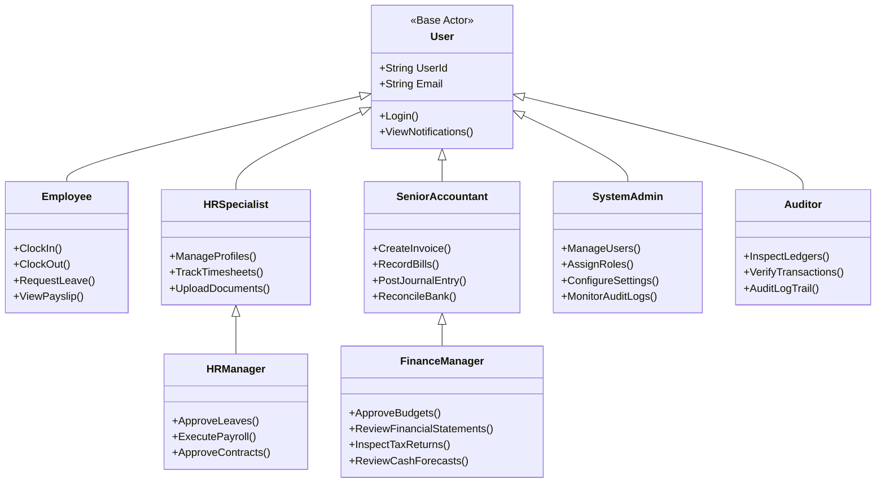
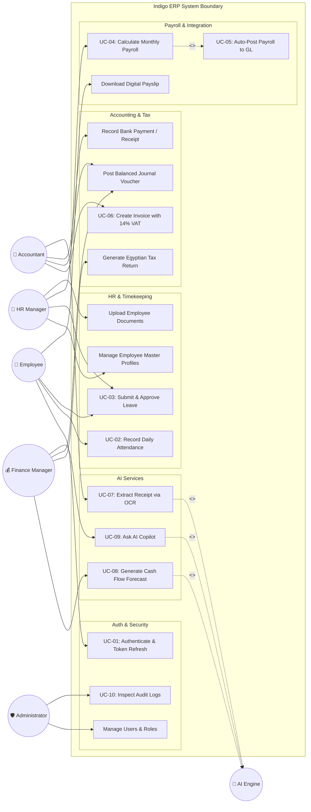
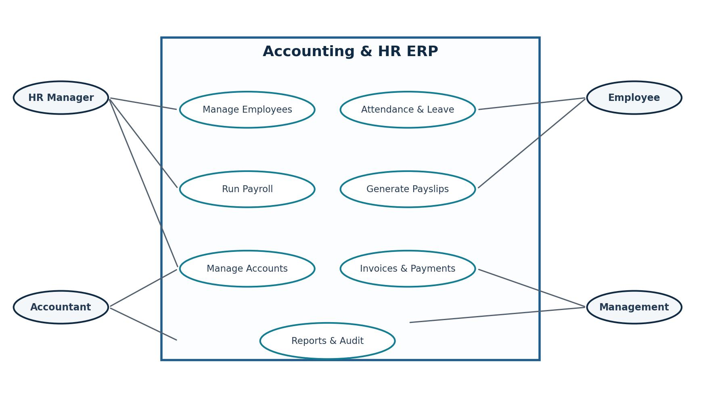

# 🎭 Use Case Analysis & Detailed Specifications
## Object-Oriented Functional Modeling for Indigo ERP with AI
### Enterprise Client: Nile Horizon Technologies S.A.E
**Project Repository:** [Saifahmed3993/ERP-System-with-AI](https://github.com/Saifahmed3993/ERP-System-with-AI)  
**Version:** 2.0.0 — Comprehensive Use Case Architecture

---

## Table of Contents
1. [Actors & Role Definitions](#1-actors--role-definitions)
2. [Master System Use Case Diagram](#2-master-system-use-case-diagram)
3. [Use Case Matrix by Module](#3-use-case-matrix-by-module)
4. [Detailed Formal Use Case Specifications](#4-detailed-formal-use-case-specifications)
   - [UC-01: Authenticate User & Issue JWT Claims](#uc-01-authenticate-user--issue-jwt-claims)
   - [UC-02: Record Employee Attendance with Anomaly Guard](#uc-02-record-employee-attendance-with-anomaly-guard)
   - [UC-03: Apply for & Approve Employee Leave](#uc-03-apply-for--approve-employee-leave)
   - [UC-04: Process & Finalize Monthly Payroll Cycle](#uc-04-process--finalize-monthly-payroll-cycle)
   - [UC-05: Automatic Dispatch of Payroll to General Ledger](#uc-05-automatic-dispatch-of-payroll-to-general-ledger)
   - [UC-06: Generate Sales Invoice with 14% Egyptian VAT](#uc-06-generate-sales-invoice-with-14-egyptian-vat)
   - [UC-07: Upload Vendor Receipt via AI OCR Parsing](#uc-07-upload-vendor-receipt-via-ai-ocr-parsing)
   - [UC-08: Execute 90-Day Predictive Cash Flow Forecast](#uc-08-execute-90-day-predictive-cash-flow-forecast)
   - [UC-09: Query Enterprise Data via AI Copilot](#uc-09-query-enterprise-data-via-ai-copilot)
   - [UC-10: Inspect Regulatory Audit Logs](#uc-10-inspect-regulatory-audit-logs)

---

## 1. Actors & Role Definitions



---

## 2. Master System Use Case Diagram



### 2.1 Visual Artifact Reference
The master Use Case architecture from the system documentation is archived below:


---

## 3. Use Case Matrix by Module

| Module | Use Case ID | Name | Primary Actor | Secondary Actors |
|:---|:---|:---|:---|:---|
| **Identity** | `UC-01` | Authenticate User & Issue JWT Claims | All Users | System Auth Provider |
| **HR** | `UC-02` | Record Attendance with Anomaly Guard | Employee | AI Anomaly Detector |
| **HR** | `UC-03` | Apply for & Approve Employee Leave | Employee | HR Manager |
| **HR** | `UC-EMP` | Maintain Employee Demographic Master | HR Specialist | HR Manager |
| **Payroll** | `UC-04` | Process & Finalize Monthly Payroll | HR Manager | System Calculation Engine |
| **Integration**| `UC-05` | Auto-Post Payroll Impact to GL | System / Event | Senior Accountant |
| **Finance** | `UC-06` | Generate Invoice with 14% Egyptian VAT | Senior Accountant| Finance Manager |
| **Finance** | `UC-JRN` | Post Double-Entry Journal Voucher | Senior Accountant| Finance Manager |
| **AI Hub** | `UC-07` | Parse Vendor Receipt via OCR | Senior Accountant| AI Vision Service |
| **AI Hub** | `UC-08` | Execute 90-Day Cash Flow Forecast | Finance Manager | AI Forecasting Engine |
| **AI Hub** | `UC-09` | Query Enterprise Data via AI Copilot | Executive / FM | AI LLM Agent |
| **Governance** | `UC-10` | Inspect Regulatory Audit Logs | Administrator | External Auditor |

---

## 4. Detailed Formal Use Case Specifications

---

### UC-01: Authenticate User & Issue JWT Claims

- **Use Case ID:** `UC-01`
- **Primary Actor:** Any Registered User (Admin, HR, Accountant, Employee)
- **Preconditions:** User has an active, unblocked account in `AspNetUsers` table.
- **Trigger:** User accesses the application and inputs credentials on `/login`.
- **Main Success Scenario (Sunny Day):**
  1. User navigates to the login screen and submits Email and Password.
  2. System retrieves identity record by normalized email.
  3. System verifies password hash using PBKDF2 with HMAC-SHA256.
  4. System fetches assigned user roles, permission claims, and linked `EmployeeId`.
  5. System generates a signed JSON Web Token (JWT) with a 15-minute expiration window containing `sub`, `email`, `role`, and `permission` claims.
  6. System generates a secure cryptographic refresh token (stored in database with 7-day expiry).
  7. Client receives the auth response, writes the access token into memory, and redirects to `/dashboard`.
- **Alternative / Exceptional Flows (Rainy Day):**
  - *Invalid Credentials:* System logs failed login attempt, increments counter, and returns `HTTP 401 Unauthorized` with generic *"Invalid email or password"*.
  - *Inactive / Suspended User:* System identifies `Status == Inactive`, halts authentication, and returns `HTTP 403 Forbidden` with *"Account is deactivated"*.
- **Postconditions:** Authenticated session established; subsequent API requests authenticated via `Authorization: Bearer <token>`.

---

### UC-02: Record Employee Attendance with Anomaly Guard

- **Use Case ID:** `UC-02`
- **Primary Actor:** Employee
- **Secondary Actor:** AI Anomaly Detection Service
- **Preconditions:** Employee is authenticated and active.
- **Trigger:** Employee clicks "Check In" or "Check Out" on the Attendance screen.
- **Main Success Scenario:**
  1. Employee clicks **Check In**; system captures client timestamp, IP address, and browser fingerprint.
  2. System checks `Attendances` table: confirms no active check-in exists for current business date.
  3. AI Anomaly module evaluates punch parameters against baseline (e.g., impossible IP relocation, outside standard shift window).
  4. System writes attendance record with `Date = Today`, `CheckInTime = UtcNow`, `Status = Present`.
  5. At shift completion, employee clicks **Check Out** directly on their attendance row.
  6. System stamps `CheckOutTime = UtcNow`, computes `TotalHours = (CheckOut - CheckIn)`, calculates overtime if $TotalHours > 8.0$.
  7. Row updates dynamically to render time duration and confirmation badge.
- **Alternative Flows:**
  - *Duplicate Check-In Attempt:* If employee has already checked in today, system displays alert: *"Employee already checked in for today"*.
  - *Anomaly Detected:* If check-in occurs from an unknown geofence or atypical time, punch is accepted but flagged with `AnomalyScore > 0.8` for HR review.
- **Postconditions:** Attendance row persisted; available for end-of-month payroll computation.

---

### UC-03: Apply for & Approve Employee Leave

- **Use Case ID:** `UC-03`
- **Primary Actor:** Employee
- **Approving Actor:** HR Manager
- **Preconditions:** Employee has available balance for requested leave type.
- **Main Success Scenario:**
  1. Employee navigates to **HR → Leave**, clicks **Apply for Leave**.
  2. Employee selects Leave Type (Annual, Sick, Casual, Unpaid), Start Date, End Date, and input reason.
  3. System calculates business days (excluding weekends and official Egyptian holidays).
  4. System verifies that requested days $\le$ available quota in `LeaveEntitlements`.
  5. Request is saved in `LeaveRequests` with `Status = Pending`.
  6. HR Manager receives notification, navigates to Leave Review queue, and clicks **Approve**.
  7. System sets `Status = Approved`, automatically decrements employee's annual leave balance by approved days.
  8. System flags attendance calendar as "On Leave" for approved date range.
- **Alternative Flows:**
  - *Insufficient Balance:* System prevents submission with error: *"Requested 5 days exceeds remaining balance of 3 days"*.
  - *Rejection by HR:* HR Manager enters mandatory rejection rationale; status set to `Rejected`; employee balance remains untouched.
- **Postconditions:** Leave logged; attendance engine will not penalize employee as absent on approved dates.

---

### UC-04: Process & Finalize Monthly Payroll Cycle

- **Use Case ID:** `UC-04`
- **Primary Actor:** HR Manager
- **Preconditions:** Current payroll period is open and unfinalized.
- **Main Success Scenario:**
  1. HR Manager navigates to **HR → Payroll**, selects Month/Year (e.g., October 2026), and clicks **Calculate Payroll**.
  2. System retrieves all active employees with salary structures.
  3. For each employee, system pulls monthly approved attendance hours, overtime hours, approved unpaid leave days, and bonuses.
  4. **Egyptian Statutory Engine computes:**
     $$\text{Gross Pay} = \text{Base} + \text{Allowances} + (\text{Overtime Hours} \times 1.5 \times \text{Hourly Rate}) + \text{Bonus}$$
     $$\text{Social Insurance (Employee 11\%)} = \min(\text{Insurable Salary}, 14500) \times 0.11$$
     $$\text{Income Tax} = \text{CalculateProgressiveTiers}(\text{Taxable Base})$$
     $$\text{Net Pay} = \text{Gross} - \text{SI} - \text{Tax} - \text{Deductions}$$
  5. Draft payroll table renders with individual and total corporate figures.
  6. HR Manager inspects registers and clicks **Approve & Finalize**.
  7. System locks payroll period (`Status = Approved`), rendering it immutable.
  8. Individual payslips become accessible to employees.
  9. System automatically triggers **UC-05 (Auto-Post Payroll to GL)**.
- **Alternative Flows:**
  - *Calculation Discrepancy:* If an employee has unclosed attendance punches, system lists validation exceptions before calculating.
  - *Period Already Finalized:* System blocks calculation: *"Payroll for this period has already been finalized"*.

---

### UC-05: Automatic Dispatch of Payroll to General Ledger

- **Use Case ID:** `UC-05`
- **Primary Actor:** System Event (Triggered by UC-04)
- **Secondary Actor:** Senior Accountant / Finance Director
- **Preconditions:** Payroll run has achieved `Approved` status.
- **Main Success Scenario:**
  1. Triggered by payroll finalization, the `PayrollPostingDispatcher` creates a new journal entry in `JournalEntries`.
  2. Sets `ReferenceNumber = PAY-2026-10`, `Date = PeriodEnd`, `Description = 'Monthly Payroll Disbursement - Oct 2026'`.
  3. Engine builds balanced debit/credit lines:
     - **Debit:** Account `5010 - Salaries & Wages Expense` with total corporate Gross Pay.
     - **Debit:** Account `5015 - Social Insurance Employer Share Expense` with 18.75% company share.
     - **Credit:** Account `2020 - Accrued Payroll Payable` with total Net Salaries.
     - **Credit:** Account `2030 - Payroll Tax Withholding Payable` with total income tax.
     - **Credit:** Account `2035 - Social Insurance Authority Payable` with combined (11% + 18.75%) SI liabilities.
  4. System validates that $\sum \text{Debit} == \sum \text{Credit}$.
  5. Entry is atomically committed and posted to General Ledger (`Status = Posted`).
  6. Accountant and Finance Director see updated ledger balances in real time.
- **Postconditions:** Financial statements immediately reflect workforce operational expenditures without manual data entry.

---

### UC-06: Generate Sales Invoice with 14% Egyptian VAT

- **Use Case ID:** `UC-06`
- **Primary Actor:** Senior Accountant
- **Preconditions:** Customer profile exists in master database.
- **Main Success Scenario:**
  1. Accountant navigates to **Finance → Invoices**, clicks **Create Invoice**.
  2. Selects customer (e.g., *Vodafone Egypt Telecommunications SAE*), sets Issue Date and Due Date (Net 30).
  3. Adds line items: Item Description, Quantity, Unit Price in EGP.
  4. System calculates Line Total, Subtotal, automatically applies **14% Egyptian VAT**:
     $$\text{VAT Amount} = \text{Subtotal} \times 0.14$$
     $$\text{Grand Total} = \text{Subtotal} + \text{VAT Amount}$$
  5. User clicks **Save & Issue**.
  6. System creates invoice with `Status = Sent`, posts an automated Accounts Receivable journal:
     - **Debit:** Account `1030 - Accounts Receivable` ($\text{Grand Total}$)
     - **Credit:** Account `4010 - Service Revenue` ($\text{Subtotal}$)
     - **Credit:** Account `2040 - VAT Output Tax Payable` ($\text{VAT Amount}$)
  7. Generates printable PDF invoice displaying tax registration number `412-985-632` and QR code for electronic invoicing compliance.
- **Postconditions:** Customer balance updated; VAT liability recognized in General Ledger.

---

### UC-07: Upload Vendor Receipt via AI OCR Parsing

- **Use Case ID:** `UC-07`
- **Primary Actor:** Senior Accountant
- **Secondary Actor:** AI Vision & OCR Engine
- **Preconditions:** Digital receipt/invoice available as PNG, JPG, or PDF.
- **Main Success Scenario:**
  1. Accountant navigates to **Finance → Expenses**, clicks **Smart Scan Receipt**.
  2. User drags and drops vendor receipt file into upload zone.
  3. System sends document payload to AI OCR processing pipeline.
  4. Computer vision model executes LayoutLM text extraction and entity recognition:
     - Discovers Vendor: *"Telecom Egypt Datacenter Services"*
     - Discovers Tax Registration: *"100-245-890"*
     - Discovers Date: *"2026-10-02"*
     - Discovers Subtotal: `EGP 25,000.00`, VAT (14%): `EGP 3,500.00`, Total: `EGP 28,500.00`
     - Matches category to Account `5030 - Datacenter & Cloud Hosting`.
  5. UI displays pre-populated form alongside document preview.
  6. Accountant reviews parsed values, verifies accuracy, and clicks **Approve Expense**.
  7. Record saved; expense voucher created with original file linked as audit attachment.
- **Alternative Flows:**
  - *Low OCR Confidence:* If document quality is degraded (confidence $< 0.70$), fields needing manual verification are highlighted in yellow for accountant confirmation.

---

### UC-08: Execute 90-Day Predictive Cash Flow Forecast

- **Use Case ID:** `UC-08`
- **Primary Actor:** Finance Manager / CFO
- **Secondary Actor:** Time-Series Forecasting Model
- **Preconditions:** Historical ledger transactions and upcoming receivables/payables exist in database.
- **Main Success Scenario:**
  1. Finance Director opens **Executive Dashboard → Cash Flow Predictor**.
  2. Selects prediction horizon: **30 Days**, **60 Days**, or **90 Days**.
  3. AI backend extracts historical daily cash flow vectors from `JournalLines` across cash and bank accounts (`1010`, `1020`, `1021`, `1022`).
  4. Combines historical vector with confirmed future events:
     - Inflows: Unsettled customer invoices filtered by weighted historical payment behavior.
     - Outflows: Pending vendor bills, statutory monthly tax liabilities, and approved payroll runs.
  5. Forecast model executes decomposition, generating expected daily net position with 95% confidence bounds.
  6. Dashboard renders interactive chart highlighting predicted liquidity runway and safety threshold breach warnings.
- **Postconditions:** Executive leadership gains data-driven foresight into capital requirements.

---

### UC-09: Query Enterprise Data via AI Copilot

- **Use Case ID:** `UC-09`
- **Primary Actor:** Executive Manager / Department Head
- **Secondary Actor:** Natural Language Text-to-SQL Agent
- **Main Success Scenario:**
  1. Manager opens Copilot chat widget and types: *"What were our top 3 operational expenses this month?"*
  2. Copilot sanitizes input, validates user permissions (verifying actor has Finance read claims).
  3. LLM agent maps intent to schema, formulating a safe parameterized read-only SQL query:
     ```sql
     SELECT TOP 3 a.Name, SUM(jl.Debit) as TotalExpense
     FROM JournalLines jl
     JOIN Accounts a ON jl.AccountId = a.AccountId
     WHERE a.Type = 'Expense' AND MONTH(jl.CreatedAt) = 10 AND YEAR(jl.CreatedAt) = 2026
     GROUP BY a.Name ORDER BY TotalExpense DESC;
     ```
  4. Query executes in read-committed snapshot isolation; results returned to Copilot.
  5. Copilot synthesizes tabular results into conversational response with charts.
- **Alternative Flows:**
  - *Attempted Data Mutation:* If user prompt attempts an `UPDATE`, `INSERT`, or `DELETE`, copilot halts: *"Copilot operates in strict read-only mode for audit safety"*.
  - *Permission Denied:* If an Employee without HR privileges asks for coworker salaries, query is blocked: *"You lack permissions to view executive compensation"*.

---

### UC-10: Inspect Regulatory Audit Logs

- **Use Case ID:** `UC-10`
- **Primary Actor:** System Administrator / External Auditor
- **Preconditions:** Actor possesses `Audit.View` permission claim.
- **Main Success Scenario:**
  1. Auditor navigates to **Admin → Audit Logs**.
  2. System displays paginated log repository showing: Timestamp, User, Action (`Created`, `Updated`, `Deleted`, `Approved`), Entity Name, Record ID, and Client IP.
  3. Auditor filters logs by Entity = `Payroll` and Action = `Approved`.
  4. Auditor clicks a specific log row to open modal showing full JSON delta (pre-change state vs. post-change state).
  5. Auditor verifies digital signature ensuring log entry has not been manipulated.
  6. Auditor clicks **Export Excel** or **Print PDF** to generate an evidentiary report for external compliance certification.
- **Postconditions:** Complete evidentiary verification delivered.

---
*End of Use Case Specifications Document*
