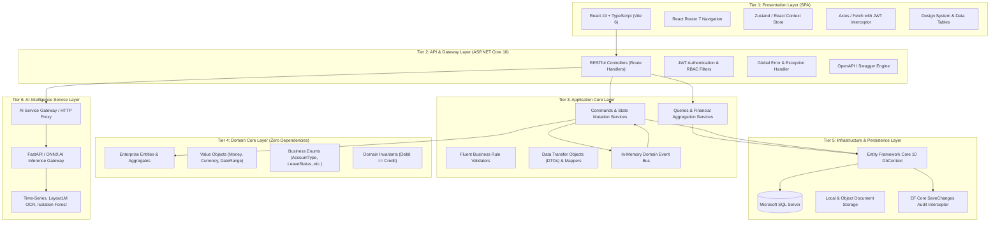
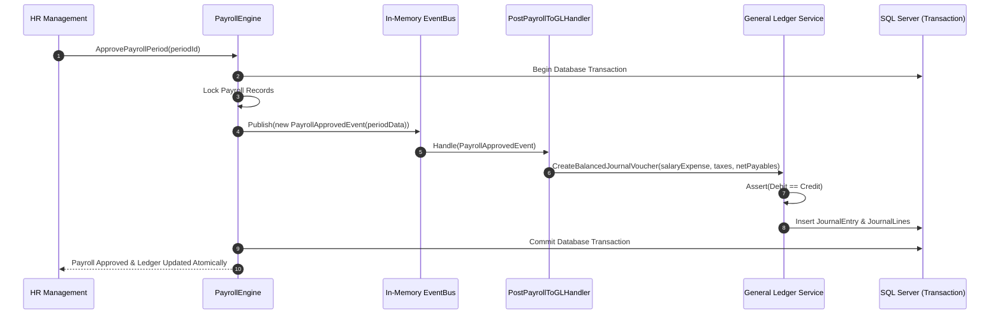
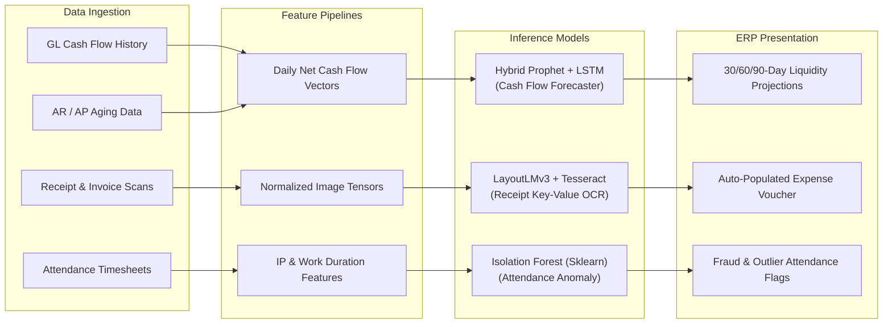
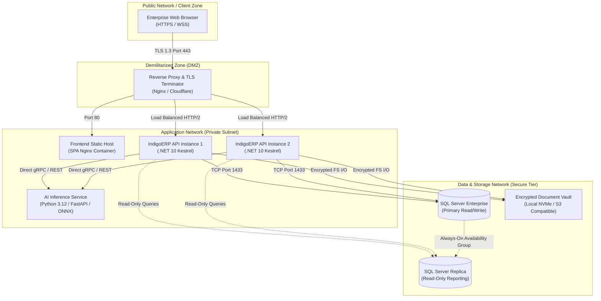

# 🏛️ System Architecture & Engineering Design
## Architectural Blueprints, Design Patterns & Component Specifications
### Comprehensive System Analysis & Design Specification
**Project Repository:** [Saifahmed3993/ERP-System-with-AI](https://github.com/Saifahmed3993/ERP-System-with-AI)  
**Version:** 2.0.0 — Comprehensive Engineering Architecture

---

## Table of Contents
1. [Architectural Philosophy: Clean Modular Monolith](#1-architectural-philosophy-clean-modular-monolith)
2. [Multi-Tiered Architectural Layering](#2-multi-tiered-architectural-layering)
3. [Component Architecture Diagram](#3-component-architecture-diagram)
4. [Enterprise Design Patterns](#4-enterprise-design-patterns)
5. [AI Intelligence Subsystem Architecture](#5-ai-intelligence-subsystem-architecture)
6. [Deployment Topology & Infrastructure Architecture](#6-deployment-topology--infrastructure-architecture)
7. [Cross-Cutting Concerns (Caching, Logging, Resilience)](#7-cross-cutting-concerns-caching-logging-resilience)

---

## 1. Architectural Philosophy: Clean Modular Monolith

**Indigo ERP with AI** is engineered as a **Clean Architecture / Onion Architecture Modular Monolith**. While microservices introduce distributed network complexity, eventual consistency hurdles, and operational overhead, a modular monolith guarantees **strict ACID transactional integrity** across the critical boundary between **Human Resources** and the **General Ledger**.

Core architectural invariants:
- **Dependency Inversion Principle:** The Domain Core has zero external dependencies. External concerns (Database, File System, AI Inference, Third-party APIs) depend on Domain abstractions.
- **Strict Bounded Contexts:** HR, Finance, Identity, and AI operate as modular domain packages within the shared runtime.
- **Zero-Latency In-Memory Integration:** Cross-module communication (such as payroll finalization triggering journal posting) utilizes in-process domain events, ensuring atomic database transactions.

---

## 2. Multi-Tiered Architectural Layering



---

## 3. Component Architecture Diagram

The following UML Component Diagram illustrates internal assembly relationships and data interfaces between system modules:

```mermaid
componentDiagram
    package "Frontend Client (React 19)" {
        [HR UI Components] as HR_UI
        [Finance UI Components] as FIN_UI
        [Dashboard & AI Widgets] as AI_UI
        [Shared Table & Export Engine] as EXPORT_UI
        [API Client Adapter] as CLIENT_API
    }

    package "Backend Host (ASP.NET Core 10)" {
        component [IndigoERP.API] as API_HOST {
            portIn "HTTP/JSON Port: 5250" as P_API
        }
        
        component [IndigoERP.Application] as APP_LAYER {
            [HR Services] as HR_SVC
            [Payroll Engine] as PAY_SVC
            [Finance Services] as FIN_SVC
            [Report Aggregator] as RPT_SVC
            [AI Bridge Service] as AI_SVC
        }

        component [IndigoERP.Domain] as DOMAIN_LAYER {
            [Employee Aggregates] as EMP_DOM
            [Payroll Records] as PAY_DOM
            [Account & Ledger Models] as FIN_DOM
            [Audit Entities] as AUD_DOM
        }

        component [IndigoERP.Infrastructure] as INFRA_LAYER {
            [AppDbContext] as DB_CTX
            [Egyptian Tax Engine] as TAX_ENG
            [Local File Storage] as FILE_STG
        }
    }

    database "Microsoft SQL Server" {
        [IndigoERPDb] as SQL_DB
    }

    package "AI Microservice (FastAPI / ONNX)" {
        component [IndigoERP.AI] as AI_HOST {
            portIn "gRPC / HTTP: 8000" as P_AI
            [Cash Forecast Model] as AI_MOD_FC
            [Receipt OCR Model] as AI_MOD_OCR
            [Anomaly Detector] as AI_MOD_ANOM
        }
    }

    HR_UI --> CLIENT_API
    FIN_UI --> CLIENT_API
    AI_UI --> CLIENT_API
    CLIENT_API --> P_API

    API_HOST --> APP_LAYER
    APP_LAYER --> DOMAIN_LAYER
    APP_LAYER --> INFRA_LAYER
    INFRA_LAYER --> SQL_DB
    AI_SVC --> P_AI
    AI_HOST --> AI_MOD_FC
    AI_HOST --> AI_MOD_OCR
    AI_HOST --> AI_MOD_ANOM
```

---

## 4. Enterprise Design Patterns

### 4.1 Repository & Unit of Work Pattern
Entity Framework Core acts as the native Unit of Work and Repository implementation. The `AppDbContext` tracks changes across multiple entities within a business transaction, committing them via an atomic `SaveChangesAsync()` call:
```csharp
public async Task<int> CommitTransactionAsync(CancellationToken cancellationToken = default)
{
    // Evaluates audit intercepts, validates debit/credit balance, commits atomically
    return await _context.SaveChangesAsync(cancellationToken);
}
```

### 4.2 In-Memory Domain Event Dispatcher (Payroll-to-GL)
To maintain module decoupling without introducing message broker overhead, payroll finalization emits an in-memory `PayrollApprovedEvent`:


### 4.3 Gateway / Adapter Pattern for AI Inference
The system isolates the primary C# application from Python/ONNX machine learning dependencies via an `IAiInferenceGateway` interface. If the AI service is offline, the ERP degrades gracefully without interrupting core accounting and payroll operations.

---

## 5. AI Intelligence Subsystem Architecture

The AI subsystem incorporates three state-of-the-art machine learning models operating in parallel:



### AI Model Technical Specifications

1. **Cash Flow Forecaster (`Prophet + LSTM`):**
   - *Input:* 5 years of daily aggregated debits/credits across Bank and Cash accounts (`1010`, `1020`, `1021`, `1022`), plus scheduled unpaid receivables and payables.
   - *Architecture:* Additive model decomposing trend, weekly seasonality (Friday/Saturday weekend in Egypt), and monthly payroll spikes.
   - *Latency:* $< 800\text{ ms}$ for 90-day forecast generation.

2. **Smart Receipt OCR (`LayoutLMv3`):**
   - *Input:* Scanned PDF, JPEG, or PNG up to 10MB.
   - *Architecture:* Multi-modal Transformer combining text tokens, 2D spatial layout coordinates, and visual image embeddings.
   - *Accuracy:* $> 94\%$ field extraction accuracy on standard Egyptian commercial receipts.

3. **Attendance Anomaly Engine (`Isolation Forest`):**
   - *Input:* Check-in timestamps, shift delta, IP subnet distance, and consecutive overtime hours.
   - *Contamination Factor:* $0.03$ (tuned to flag top 3% statistical anomalies for human review).

---

## 6. Deployment Topology & Infrastructure Architecture

The system supports containerized deployment across cloud environments (Azure / AWS) or secure on-premise infrastructure in the company's datacenter:



---

## 7. Cross-Cutting Concerns

### 7.1 Distributed Caching
- Lookups for static master data (Chart of Accounts, Departments, Positions, Tax Rates) utilize in-memory caching with sliding expiration. Cache eviction triggers automatically upon administrative mutation.

### 7.2 Structured Audit Interceptor
- Implemented via Entity Framework Core's `SaveChangesInterceptor`. Every state transition captures the operating user ID, client IP address, action verb, timestamp in UTC, and a JSON diff of changed properties into the immutable `AuditLogs` table.

### 7.3 Resilience & Fault Tolerance
- HTTP calls to AI microservices and external bank gateways are wrapped in **Polly** resilience policies featuring exponential backoff, circuit breaking (5 failures threshold), and graceful fallback to offline defaults.

---
*End of System Architecture Document*
