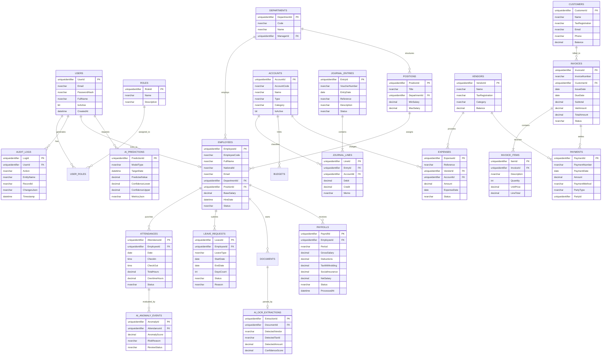

# 🗄️ Database Design & Entity Relationship Diagram (ERD)
## Physical Relational Database Architecture & Comprehensive Data Dictionary
### Enterprise Client: Nile Horizon Technologies S.A.E
**Project Repository:** [Saifahmed3993/ERP-System-with-AI](https://github.com/Saifahmed3993/ERP-System-with-AI)  
**Version:** 2.0.0 — Comprehensive Database Architecture  
**Target RDBMS:** Microsoft SQL Server 2022+ / Azure SQL  
**Collation:** `Arabic_100_CI_AS` (Bilingual Arabic/English Support)

---

## Table of Contents
1. [Database Architectural Principles](#1-database-architectural-principles)
2. [Master Entity Relationship Diagram (ERD)](#2-master-entity-relationship-diagram-erd)
3. [Comprehensive Data Dictionary](#3-comprehensive-data-dictionary)
   - [3.1 Identity, Security & Governance Domain](#31-identity-security--governance-domain)
   - [3.2 Human Resources & Workforce Domain](#32-human-resources--workforce-domain)
   - [3.3 Compensation & Payroll Domain](#33-compensation--payroll-domain)
   - [3.4 Financial Ledger & Accounting Domain](#34-financial-ledger--accounting-domain)
   - [3.5 Billing, Payables & Receivables Domain](#35-billing-payables--receivables-domain)
   - [3.6 AI Intelligence & Telemetry Domain](#36-ai-intelligence--telemetry-domain)
4. [Indexing Strategy & Performance Optimization](#4-indexing-strategy--performance-optimization)
5. [Database Integrity Constraints & Business Triggers](#5-database-integrity-constraints--business-triggers)

---

## 1. Database Architectural Principles

The relational schema for **Indigo ERP with AI** is designed to satisfy the rigorous demands of enterprise accounting and workforce governance:

1. **Third Normal Form (3NF) Normalization:** Redundancy is rigorously eliminated across master records to prevent update anomalies. Derived financial balances are calculated dynamically from immutable transaction ledgers.
2. **ACID Transaction Guarantees:** Multi-table operations (such as payroll finalization or sales invoice posting) are wrapped in atomic database transactions with serializable or read-committed snapshot isolation.
3. **Auditability & Temporal Tracking:** All primary tables inherit standard temporal shadow attributes: `CreatedAt` (UTC datetime), `CreatedBy` (Guid), `UpdatedAt` (UTC datetime), `UpdatedBy` (Guid), and `IsDeleted` (Soft-delete bit flag).
4. **Bilingual Unicode Support:** Text attributes utilize `NVARCHAR` with Arabic case-insensitive accent-sensitive collation (`Arabic_100_CI_AS`), ensuring proper search and sorting for Egyptian names and official tax descriptions.

---

## 2. Master Entity Relationship Diagram (ERD)



### 2.1 Visual Artifact Reference
The initial logical data model from the design archive is captured below:


---

## 3. Comprehensive Data Dictionary

---

### 3.1 Identity, Security & Governance Domain

#### Table: `Users` (`AspNetUsers`)
| Column Name | Data Type | Nullable | Constraints | Default | Description |
|:---|:---|:---:|:---|:---:|:---|
| `Id` | `uniqueidentifier` | No | PK | `NEWID()` | Unique user identifier |
| `Email` | `nvarchar(256)` | No | UNIQUE, INDEX | — | Official enterprise email address |
| `PasswordHash` | `nvarchar(max)` | No | — | — | PBKDF2/Argon2 password hash |
| `FullName` | `nvarchar(150)` | No | — | — | Full display name in English / Arabic |
| `EmployeeId` | `uniqueidentifier` | Yes | FK -> `Employees(Id)` | NULL | Optional link to employee profile |
| `IsActive` | `bit` | No | — | 1 | Account status flag |
| `CreatedAt` | `datetime2` | No | — | `SYSUTCDATETIME()` | Account creation timestamp |

#### Table: `AuditLogs`
| Column Name | Data Type | Nullable | Constraints | Default | Description |
|:---|:---|:---:|:---|:---:|:---|
| `Id` | `uniqueidentifier` | No | PK | `NEWID()` | Unique audit record identifier |
| `UserId` | `uniqueidentifier` | Yes | FK -> `Users(Id)` | NULL | Actor who initiated the mutation |
| `Action` | `nvarchar(50)` | No | INDEX | — | Action verb: `CREATE`, `UPDATE`, `DELETE`, `APPROVE` |
| `EntityName` | `nvarchar(100)` | No | INDEX | — | Name of modified table/entity |
| `RecordId` | `nvarchar(100)` | No | — | — | Primary key of target record |
| `ChangesJson` | `nvarchar(max)` | Yes | — | NULL | JSON diff representation (before / after) |
| `ClientIp` | `nvarchar(45)` | Yes | — | NULL | IPv4 / IPv6 network address |
| `Timestamp` | `datetime2` | No | INDEX | `SYSUTCDATETIME()` | Exact UTC event timestamp |

---

### 3.2 Human Resources & Workforce Domain

#### Table: `Employees`
| Column Name | Data Type | Nullable | Constraints | Default | Description |
|:---|:---|:---:|:---|:---:|:---|
| `Id` | `uniqueidentifier` | No | PK | `NEWID()` | Unique employee identifier |
| `EmployeeCode` | `nvarchar(20)` | No | UNIQUE, INDEX | — | Employee ID code (e.g. `EMP-001`) |
| `FullName` | `nvarchar(150)` | No | INDEX | — | Full name in English / Arabic |
| `NationalId` | `nvarchar(14)` | No | UNIQUE | — | 14-digit Egyptian National ID number |
| `DepartmentId` | `uniqueidentifier` | No | FK -> `Departments(Id)` | — | Assigned organizational department |
| `PositionId` | `uniqueidentifier` | No | FK -> `Positions(Id)` | — | Assigned job title & grade |
| `BaseSalary` | `decimal(18,2)` | No | CHECK (`BaseSalary > 0`) | — | Monthly contractual base salary in EGP |
| `HireDate` | `date` | No | — | — | Date of employment commencement |
| `Status` | `nvarchar(30)` | No | INDEX | `'Active'` | Status: `Active`, `On Leave`, `Terminated` |

#### Table: `Attendances`
| Column Name | Data Type | Nullable | Constraints | Default | Description |
|:---|:---|:---:|:---|:---:|:---|
| `Id` | `uniqueidentifier` | No | PK | `NEWID()` | Attendance punch record ID |
| `EmployeeId` | `uniqueidentifier` | No | FK -> `Employees(Id)` | — | Foreign key linking to employee |
| `Date` | `date` | No | INDEX | — | Work day date (YYYY-MM-DD) |
| `CheckIn` | `time(0)` | No | — | — | Morning check-in time |
| `CheckOut` | `time(0)` | Yes | — | NULL | Evening check-out time |
| `TotalHours` | `decimal(5,2)` | No | — | 0.00 | Total calculated active working hours |
| `OvertimeHours`| `decimal(5,2)` | No | — | 0.00 | Hours exceeding standard 8-hour shift |
| `Status` | `nvarchar(30)` | No | — | `'Present'` | `Present`, `Late`, `Half-day`, `Absent` |

#### Table: `LeaveRequests`
| Column Name | Data Type | Nullable | Constraints | Default | Description |
|:---|:---|:---:|:---|:---:|:---|
| `Id` | `uniqueidentifier` | No | PK | `NEWID()` | Unique leave request identifier |
| `EmployeeId` | `uniqueidentifier` | No | FK -> `Employees(Id)` | — | Requesting employee |
| `LeaveType` | `nvarchar(50)` | No | — | — | `Annual`, `Sick`, `Casual`, `Unpaid` |
| `StartDate` | `date` | No | — | — | Leave commencement date |
| `EndDate` | `date` | No | — | — | Leave conclusion date |
| `DaysCount` | `int` | No | CHECK (`DaysCount > 0`) | — | Net working days requested |
| `Status` | `nvarchar(30)` | No | INDEX | `'Pending'` | `Pending`, `Approved`, `Rejected` |
| `ApprovedBy` | `uniqueidentifier` | Yes | FK -> `Users(Id)` | NULL | HR Manager user ID who approved |

---

### 3.3 Compensation & Payroll Domain

#### Table: `Payrolls`
| Column Name | Data Type | Nullable | Constraints | Default | Description |
|:---|:---|:---:|:---|:---:|:---|
| `Id` | `uniqueidentifier` | No | PK | `NEWID()` | Unique payroll record identifier |
| `EmployeeId` | `uniqueidentifier` | No | FK -> `Employees(Id)` | — | Target employee |
| `Period` | `nvarchar(7)` | No | INDEX | — | Pay period (e.g. `2026-10`) |
| `GrossSalary` | `decimal(18,2)` | No | — | 0.00 | Base + Allowances + Overtime in EGP |
| `SocialInsurance`| `decimal(18,2)`| No | — | 0.00 | Employee 11% social insurance deduction |
| `TaxWithholding`| `decimal(18,2)` | No | — | 0.00 | Egyptian progressive income tax |
| `OtherDeductions`|`decimal(18,2)` | No | — | 0.00 | Unpaid leaves, penalties, loan repayments |
| `NetSalary` | `decimal(18,2)` | No | — | 0.00 | Final take-home net payout |
| `Status` | `nvarchar(30)` | No | INDEX | `'Draft'` | `Draft`, `Approved`, `Disbursed` |
| `PostedEntryId`| `uniqueidentifier` | Yes | FK -> `JournalEntries(Id)` | NULL | Linked GL journal entry voucher |

---

### 3.4 Financial Ledger & Accounting Domain

#### Table: `Accounts` (Chart of Accounts)
| Column Name | Data Type | Nullable | Constraints | Default | Description |
|:---|:---|:---:|:---|:---:|:---|
| `Id` | `uniqueidentifier` | No | PK | `NEWID()` | Unique account identifier |
| `AccountCode` | `nvarchar(20)` | No | UNIQUE, INDEX | — | Numerical code (e.g. `1020`, `5010`) |
| `Name` | `nvarchar(150)` | No | — | — | Account name (e.g. `CIB Operating Account`) |
| `Type` | `nvarchar(50)` | No | INDEX | — | `Asset`, `Liability`, `Equity`, `Revenue`, `Expense` |
| `Category` | `nvarchar(50)` | No | — | — | Sub-category: `Cash`, `Current Asset`, etc. |
| `IsActive` | `bit` | No | — | 1 | Operational status flag |

#### Table: `JournalEntries`
| Column Name | Data Type | Nullable | Constraints | Default | Description |
|:---|:---|:---:|:---|:---:|:---|
| `Id` | `uniqueidentifier` | No | PK | `NEWID()` | Unique journal entry identifier |
| `VoucherNumber`| `nvarchar(50)` | No | UNIQUE, INDEX | — | Formatted voucher (e.g. `JV-2026-0045`) |
| `EntryDate` | `date` | No | INDEX | — | Accounting effective date |
| `Reference` | `nvarchar(100)` | Yes | — | NULL | External reference (e.g. `PAY-OCT-26`) |
| `Description` | `nvarchar(500)` | No | — | — | Narrative transaction memo |
| `Status` | `nvarchar(30)` | No | INDEX | `'Draft'` | `Draft`, `Posted`, `Void` |

#### Table: `JournalLines`
| Column Name | Data Type | Nullable | Constraints | Default | Description |
|:---|:---|:---:|:---|:---:|:---|
| `Id` | `uniqueidentifier` | No | PK | `NEWID()` | Unique journal line identifier |
| `EntryId` | `uniqueidentifier` | No | FK -> `JournalEntries(Id)` | — | Parent journal voucher |
| `AccountId` | `uniqueidentifier` | No | FK -> `Accounts(Id)` | — | Chart of account classification |
| `Debit` | `decimal(18,2)` | No | CHECK (`Debit >= 0`) | 0.00 | Debit monetary amount in EGP |
| `Credit` | `decimal(18,2)` | No | CHECK (`Credit >= 0`) | 0.00 | Credit monetary amount in EGP |
| `Memo` | `nvarchar(255)` | Yes | — | NULL | Optional line-specific annotation |

---

### 3.5 Billing, Payables & Receivables Domain

#### Table: `Invoices`
| Column Name | Data Type | Nullable | Constraints | Default | Description |
|:---|:---|:---:|:---|:---:|:---|
| `Id` | `uniqueidentifier` | No | PK | `NEWID()` | Unique sales invoice identifier |
| `InvoiceNumber`| `nvarchar(50)` | No | UNIQUE, INDEX | — | Sequential invoice code (e.g. `INV-2026-012`) |
| `CustomerId` | `uniqueidentifier` | No | FK -> `Customers(Id)` | — | Client billed |
| `IssueDate` | `date` | No | — | — | Date of invoice issuance |
| `DueDate` | `date` | No | INDEX | — | Payment due date (e.g. Net 30) |
| `Subtotal` | `decimal(18,2)` | No | — | 0.00 | Net amount before tax |
| `VatAmount` | `decimal(18,2)` | No | — | 0.00 | 14% Egyptian VAT calculated amount |
| `TotalAmount` | `decimal(18,2)` | No | — | 0.00 | Subtotal + VatAmount in EGP |
| `PaidAmount` | `decimal(18,2)` | No | — | 0.00 | Total payments collected to date |
| `Status` | `nvarchar(30)` | No | INDEX | `'Draft'` | `Draft`, `Sent`, `Paid`, `Overdue` |

---

### 3.6 AI Intelligence & Telemetry Domain

#### Table: `AiPredictions`
| Column Name | Data Type | Nullable | Constraints | Default | Description |
|:---|:---|:---:|:---|:---:|:---|
| `Id` | `uniqueidentifier` | No | PK | `NEWID()` | Unique forecast prediction record |
| `ModelType` | `nvarchar(50)` | No | INDEX | — | Model name (`CashFlow_Prophet_v2`) |
| `GeneratedAt` | `datetime2` | No | — | `SYSUTCDATETIME()` | Timestamp when inference ran |
| `TargetDate` | `date` | No | INDEX | — | Forecasted calendar date |
| `PredictedValue`| `decimal(18,2)`| No | — | — | Expected net cash balance in EGP |
| `ConfidenceLower`|`decimal(18,2)`| No | — | — | Lower 95% confidence boundary |
| `ConfidenceUpper`|`decimal(18,2)`| No | — | — | Upper 95% confidence boundary |

#### Table: `AiAnomalyEvents`
| Column Name | Data Type | Nullable | Constraints | Default | Description |
|:---|:---|:---:|:---|:---:|:---|
| `Id` | `uniqueidentifier` | No | PK | `NEWID()` | Anomaly incident identifier |
| `AttendanceId`| `uniqueidentifier` | No | FK -> `Attendances(Id)`| — | Linked attendance punch |
| `AnomalyScore`| `decimal(5,4)` | No | — | — | Statistical score ($0.0000 - 1.0000$) |
| `RiskReason` | `nvarchar(255)` | No | — | — | Explanation (e.g. *Impossible relocation speed*) |
| `ReviewStatus`| `nvarchar(30)` | No | — | `'Pending'` | `Pending`, `Dismissed`, `ConfirmedFraud` |

---

## 4. Indexing Strategy & Performance Optimization

To guarantee sub-200ms API response latency across high-volume tables, composite indices are strategically deployed:

```sql
-- 1. Accelerates daily employee attendance lookup and check-in validation
CREATE UNIQUE NONCLUSTERED INDEX IX_Attendances_EmployeeDate 
ON Attendances (EmployeeId, Date);

-- 2. Optimizes General Ledger statement generation by account and date range
CREATE NONCLUSTERED INDEX IX_JournalLines_Account_Entry 
ON JournalLines (AccountId) 
INCLUDE (Debit, Credit, EntryId);

-- 3. Accelerates customer accounts receivable aging and overdue invoice queries
CREATE NONCLUSTERED INDEX IX_Invoices_Customer_Status_DueDate 
ON Invoices (CustomerId, Status, DueDate) 
INCLUDE (TotalAmount, PaidAmount);

-- 4. Optimizes audit log search by entity and chronological order
CREATE NONCLUSTERED INDEX IX_AuditLogs_Entity_Timestamp 
ON AuditLogs (EntityName, Timestamp DESC) 
INCLUDE (Action, UserId, RecordId);
```

---

## 5. Database Integrity Constraints & Business Triggers

### 5.1 Enforcing Double-Entry Balance Invariant ($\sum \text{Debit} == \sum \text{Credit}$)
A database trigger guarantees that un-balanced journal vouchers can never transition to `Posted` status:

```sql
CREATE TRIGGER TR_JournalEntries_EnforceBalance
ON JournalEntries
AFTER UPDATE
AS
BEGIN
    SET NOCOUNT ON;
    
    IF EXISTS (
        SELECT 1 
        FROM inserted i
        JOIN (
            SELECT EntryId, SUM(Debit) AS TotalDebit, SUM(Credit) AS TotalCredit
            FROM JournalLines
            GROUP BY EntryId
        ) lines ON i.Id = lines.EntryId
        WHERE i.Status = 'Posted' 
          AND ABS(lines.TotalDebit - lines.TotalCredit) > 0.001
    )
    BEGIN
        RAISERROR ('Financial Integrity Violation: Cannot post an unbalanced journal entry.', 16, 1);
        ROLLBACK TRANSACTION;
        RETURN;
    END
END;
```

---
*End of Database Design & ERD Specification*
