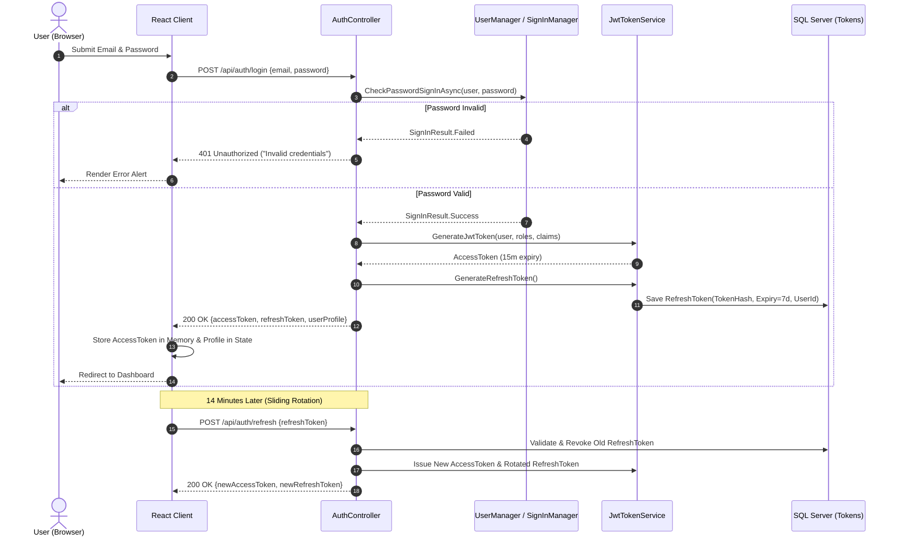
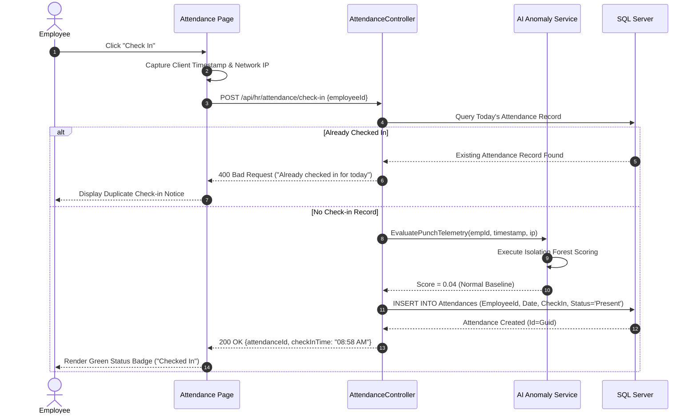
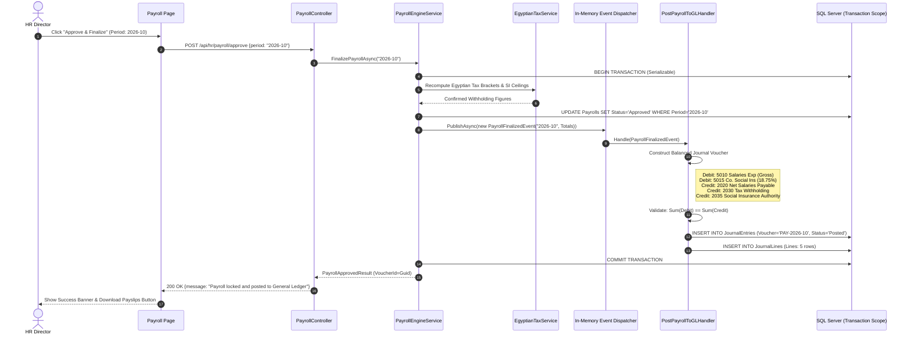
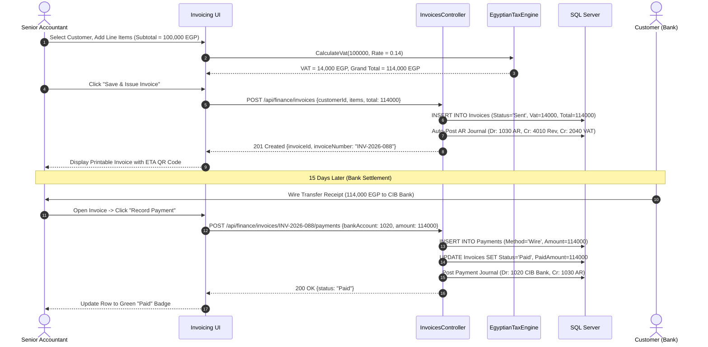
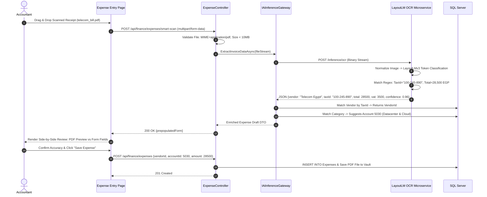
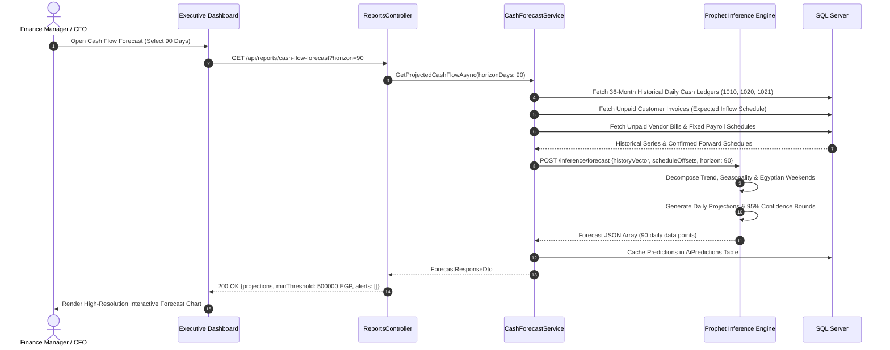
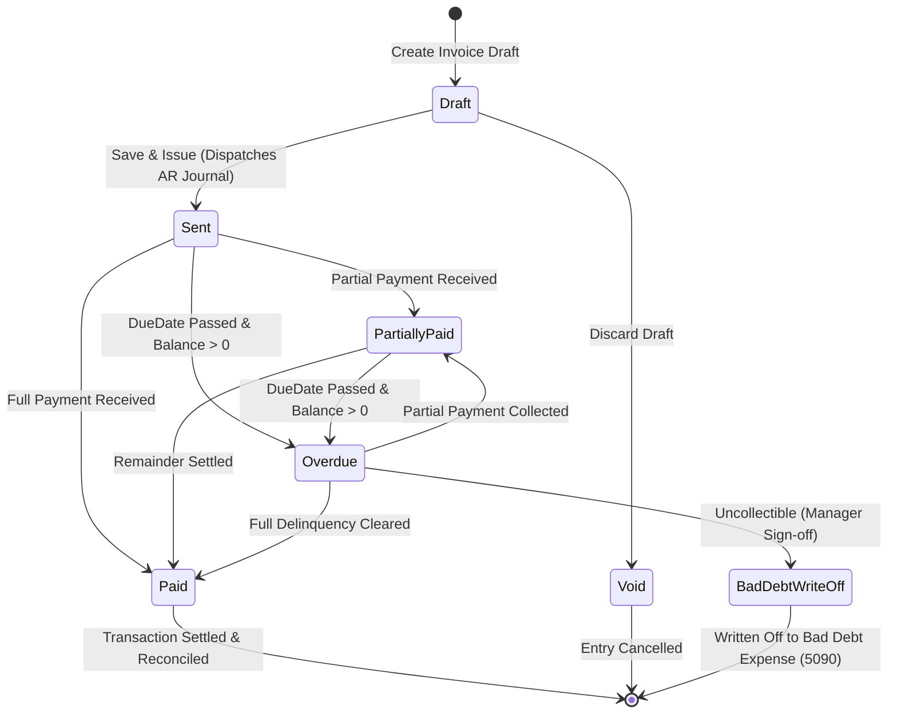
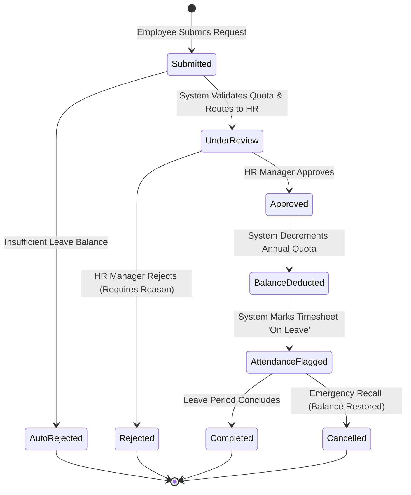
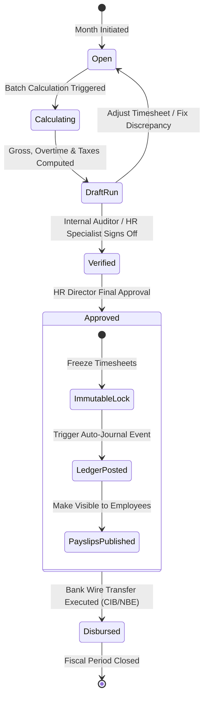
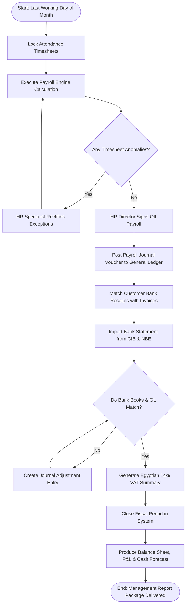

# ⏱️ Dynamic Behavioral Modeling: Sequence & State Diagrams
## UML Sequence Interactions, State Machines & Workflow Lifecycles
### Comprehensive System Analysis & Design Specification
**Project Repository:** [Saifahmed3993/ERP-System-with-AI](https://github.com/Saifahmed3993/ERP-System-with-AI)  
**Version:** 2.0.0 — Dynamic Behavioral Architecture

---

## Table of Contents
1. [Introduction to Dynamic Behavioral Modeling](#1-introduction-to-dynamic-behavioral-modeling)
2. [Detailed UML Sequence Diagrams](#2-detailed-uml-sequence-diagrams)
   - [2.1 Sequence 1: Authentication & Refresh Token Rotation](#21-sequence-1-authentication--refresh-token-rotation)
   - [2.2 Sequence 2: Attendance Check-In with AI Anomaly Guard](#22-sequence-2-attendance-check-in-with-ai-anomaly-guard)
   - [2.3 Sequence 3: Payroll Finalization & Atomic GL Dispatch](#23-sequence-3-payroll-finalization--atomic-gl-dispatch)
   - [2.4 Sequence 4: Invoicing with 14% VAT & Payment Allocation](#24-sequence-4-invoicing-with-14-vat--payment-allocation)
   - [2.5 Sequence 5: Receipt OCR Extraction & Expense Voucher Drafting](#25-sequence-5-receipt-ocr-extraction--expense-voucher-drafting)
   - [2.6 Sequence 6: Predictive Cash Flow Inference & Delivery](#26-sequence-6-predictive-cash-flow-inference--delivery)
3. [UML State Machine Diagrams](#3-uml-state-machine-diagrams)
   - [3.1 Invoice Financial Lifecycle State Machine](#31-invoice-financial-lifecycle-state-machine)
   - [3.2 Leave Request Approval State Machine](#32-leave-request-approval-state-machine)
   - [3.3 Monthly Payroll Period State Machine](#33-monthly-payroll-period-state-machine)
4. [Activity Diagram: End-of-Month Financial Reconciliation](#4-activity-diagram-end-of-month-financial-reconciliation)

---

## 1. Introduction to Dynamic Behavioral Modeling

While class and entity relationship diagrams capture static system topology, dynamic models capture the temporal behavior, state transitions, and asynchronous messaging that occur during runtime operations.

This document formalizes the behavioral contracts between the **React Presentation Layer**, **ASP.NET Core Application Services**, **Entity Framework Core Database Layer**, and the **AI Intelligence Services**.

---

## 2. Detailed UML Sequence Diagrams

---

### 2.1 Sequence 1: Authentication & Refresh Token Rotation

---

### 2.2 Sequence 2: Attendance Check-In with AI Anomaly Guard

---

### 2.3 Sequence 3: Payroll Finalization & Atomic GL Dispatch

The pivotal architectural sequence illustrating the automated transition from HR compensation approval to General Ledger balance commitment:

---

### 2.4 Sequence 4: Invoicing with 14% VAT & Payment Allocation

---

### 2.5 Sequence 5: Receipt OCR Extraction & Expense Voucher Drafting

---

### 2.6 Sequence 6: Predictive Cash Flow Inference & Delivery

---

## 3. UML State Machine Diagrams

---

### 3.1 Invoice Financial Lifecycle State Machine

---

### 3.2 Leave Request Approval State Machine

---

### 3.3 Monthly Payroll Period State Machine

---

## 4. Activity Diagram: End-of-Month Financial Reconciliation

---
*End of Dynamic Behavioral Modeling Document*
