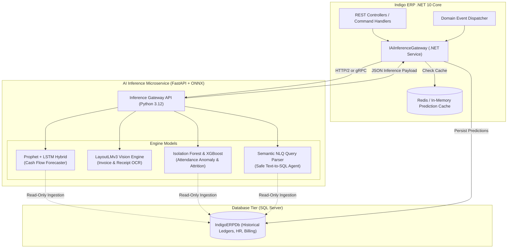
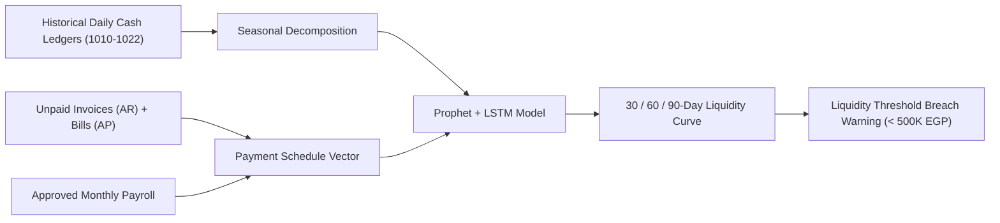
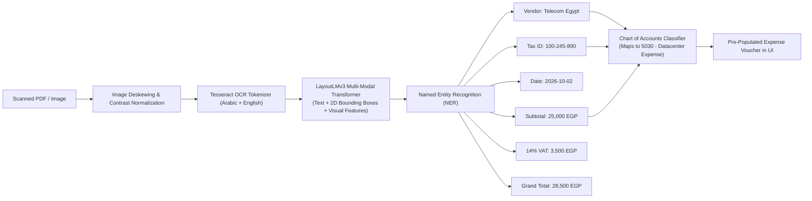
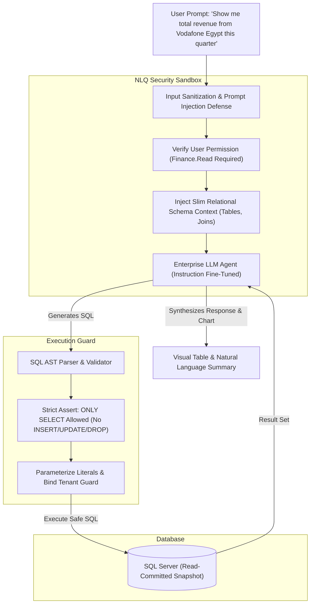

# 🤖 AI Intelligence Architecture & Machine Learning Modules
## Predictive Financial Modeling, Computer Vision OCR & Workforce Analytics
### Comprehensive System Analysis & Design Specification
**Project Repository:** [Saifahmed3993/ERP-System-with-AI](https://github.com/Saifahmed3993/ERP-System-with-AI)  
**Version:** 2.0.0 — AI Engineering Architecture

---

## Table of Contents
1. [AI Subsystem Architectural Blueprint](#1-ai-subsystem-architectural-blueprint)
2. [Module 1: Predictive Cash Flow Forecasting Engine](#2-module-1-predictive-cash-flow-forecasting-engine)
3. [Module 2: Intelligent Document OCR & Expense Auto-Coding](#3-module-2-intelligent-document-ocr--expense-auto-coding)
4. [Module 3: Workforce Intelligence & Anomaly Detection](#4-module-3-workforce-intelligence--anomaly-detection)
5. [Module 4: Natural Language ERP Copilot (Text-to-SQL)](#5-module-4-natural-language-erp-copilot-text-to-sql)
6. [Data Privacy, Security & Model Governance](#6-data-privacy-security--model-governance)

---

## 1. AI Subsystem Architectural Blueprint

In **Indigo ERP with AI**, machine learning capabilities are not superficial bolt-ons; they are integrated into transactional workflows as an asynchronous, low-latency intelligence layer.

---

## 2. Module 1: Predictive Cash Flow Forecasting Engine

### 2.1 Mathematical Formulation
Corporate cash flow is formulated as an additive decomposed time-series:
$$y(t) = g(t) + s(t) + h(t) + f(t) + \epsilon_t$$

Where:
- $g(t)$: **Piecewise Logistic Growth Trend** reflecting organizational revenue trajectory and non-linear baseline inflation.
- $s(t)$: **Periodic Seasonality**:
  * Weekly seasonality accounting for the Egyptian corporate work week (Sunday through Thursday active, Friday and Saturday weekend).
  * Monthly end-of-month payroll and tax liability cycles.
- $h(t)$: **Holiday & Cultural Multipliers** (Ramadan operational slowdowns, Eid al-Fitr, Eid al-Adha, and Coptic Christmas).
- $f(t)$: **Known Forward Cash Flows** extracted deterministically from ERP master records:
  $$f(t) = \sum \text{Unsettled Invoices}(t) \times P_{\text{collection}} - \sum \text{Vendor Bills}(t) - \text{Scheduled Payroll}(t)$$
- $\epsilon_t$: Normally distributed residual error $\mathcal{N}(0, \sigma^2)$.

### 2.2 Model Confidence Intervals
Predictions are output with $95\%$ confidence bounds ($\hat{y} \pm 1.96 \cdot \hat{\sigma}$). If the lower bound breaches the corporate liquidity threshold (configured as `EGP 500,000` for the enterprise), an automated alert notification is routed to the Finance Director.

---

## 3. Module 2: Intelligent Document OCR & Expense Auto-Coding

### 3.1 LayoutLMv3 Multi-Modal Pipeline
When an accountant uploads an invoice or expense voucher (PDF, PNG, or JPEG), the document passes through a multi-modal computer vision and layout transformer:

### 3.2 Automated General Ledger Code Mapping
A TF-IDF and dense embedding classifier matches vendor names and line item descriptions to the organization's Chart of Accounts:
- *"Amazon Web Services"* or *"Cloud Hosting"* $\rightarrow$ Account `5030 - IT & Hosting Infrastructure`
- *"Smart Village Facilities Rent"* $\rightarrow$ Account `5020 - Office Rent & Facilities`
- *"AXA Insurance"* $\rightarrow$ Account `5016 - Group Health Insurance`

---

## 4. Module 3: Workforce Intelligence & Anomaly Detection

### 4.1 Attendance Anomaly Detection (Isolation Forest)
The system continually evaluates employee check-in and check-out logs to safeguard against timesheet falsification, ghost punching, and burnout-inducing overtime.

- **Feature Vectors:**
  1. $\Delta t_{\text{checkin}}$: Deviation from standard shift start time (minutes).
  2. $\text{IP}_{\text{entropy}}$: Subnet variability of client IP address.
  3. $\text{Speed}_{\text{transit}}$: Calculated velocity between consecutive punches ($km/h$).
  4. $\text{Overtime}_{\text{zscore}}$: Standardized distance from department mean overtime:
     $$Z = \frac{X_{\text{overtime}} - \mu_{\text{dept}}}{\sigma_{\text{dept}}}$$

If the tree ensemble calculates an anomaly score $> 0.75$, the attendance record is accepted but automatically routed to the HR Director's review queue.

### 4.2 Employee Attrition Risk Predictor
An XGBoost classification model monitors macro-workforce health to identify key personnel flight risk:
- **Inputs:** Consecutive overtime hours, unused annual leave accumulation, salary ratio relative to market position benchmark, tenure (months), and last performance appraisal score.
- **Output:** Attrition Risk Probability ($0.0 - 1.0$) categorized into `Low`, `Medium`, or `High`, enabling proactive retention conversations before resignation occurs.

---

## 5. Module 4: Natural Language ERP Copilot (Text-to-SQL)

### 5.1 AST Security Guard & Zero-Mutation Guarantee
Before any generated SQL query reaches the database engine, it passes through an Abstract Syntax Tree (AST) validator. Any statement containing `DROP`, `ALTER`, `TRUNCATE`, `UPDATE`, `INSERT`, `EXEC`, or `--` comments is instantly rejected with a security alert.

---

## 6. Data Privacy, Security & Model Governance

1. **On-Premise Data Residency:** All AI inference runs within the enterprise boundary or a dedicated private VPC. Customer data and employee payroll records are never transmitted to public multi-tenant APIs.
2. **PII Masking:** Before text vectors are processed by natural language models, sensitive identifiers (Egyptian National IDs, bank IBANs, and home addresses) are scrubbed via token replacement.
3. **Drift Monitoring:** The cash flow forecasting model performs automated backtesting monthly; if the Mean Absolute Percentage Error (MAPE) degrades beyond $12\%$, an automated retraining pipeline triggers using the latest 12 months of ledger data.

---
*End of AI Intelligence Architecture Document*
