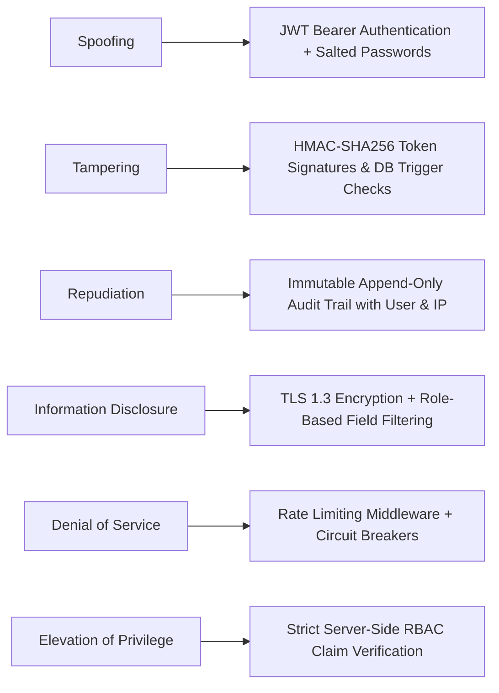
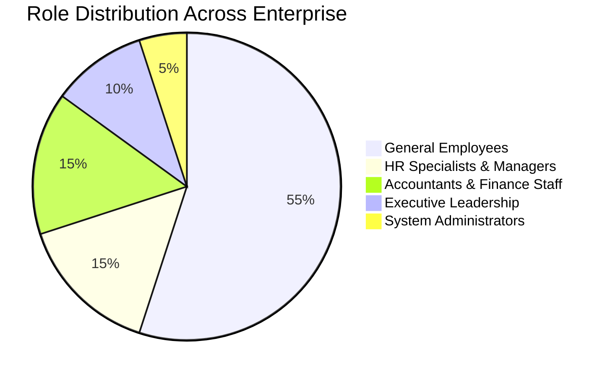
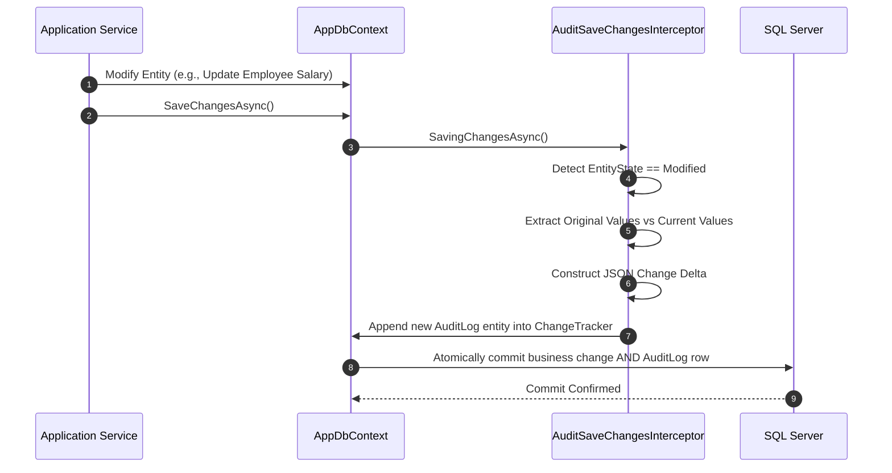

# 🛡️ Security, Governance & Regulatory Compliance Architecture
## RBAC Permission Matrix, Audit Trail Architecture & Egyptian Statutory Compliance
### Comprehensive System Analysis & Design Specification
**Project Repository:** [Saifahmed3993/ERP-System-with-AI](https://github.com/Saifahmed3993/ERP-System-with-AI)  
**Version:** 2.0.0 — Security & Governance Engineering

---

## Table of Contents
1. [Security Architecture Overview](#1-security-architecture-overview)
2. [STRIDE Threat Modeling Matrix](#2-stride-threat-modeling-matrix)
3. [Master Role-Based Access Control (RBAC) Matrix](#3-master-role-based-access-control-rbac-matrix)
4. [Immutable Audit Trail Architecture](#4-immutable-audit-trail-architecture)
5. [Egyptian Statutory & Tax Compliance Framework](#5-egyptian-statutory--tax-compliance-framework)
   - [5.1 Egyptian Value Added Tax (VAT) Law (14%)](#51-egyptian-value-added-tax-vat-law-14)
   - [5.2 Egyptian Labor Law No. 12 of 2003](#52-egyptian-labor-law-no-12-of-2003)
   - [5.3 Social Insurance & Withholding Tax Rules](#53-social-insurance--withholding-tax-rules)
6. [Cryptographic Standards & Data Protection](#6-cryptographic-standards--data-protection)

---

## 1. Security Architecture Overview

Enterprise Resource Planning platforms harbor the most sensitive assets of a corporation: executive compensation, employee personal identifiers, intellectual property, customer invoices, and bank account details.

**Indigo ERP with AI** adopts a **Zero-Trust Security Architecture**:
- Every API endpoint is authenticated by default; anonymous access is explicitly whitelisted only for `/api/auth/login`.
- Authorization is checked at both the controller gateway level and inside application domain handlers.
- Cryptographic signatures guarantee data integrity in transit and non-repudiation in audit records.

---

## 2. STRIDE Threat Modeling Matrix



| STRIDE Category | Potential Vulnerability | System Countermeasure & Implementation |
|:---|:---|:---|
| **Spoofing** | Attacker impersonates an accountant or executive | Multi-factor ready JWT bearer tokens, Argon2/PBKDF2 password hashing, short token lifetimes (15m). |
| **Tampering** | User modifies net salary in client DOM before submit | Server-side statutory recalculation; client input is treated as untrusted; debit/credit sums verified by DB triggers. |
| **Repudiation** | Manager denies having authorized a 50,000 EGP expense | Append-only `AuditLogs` capturing authenticated `UserId`, UTC timestamp, action verb, and client IP address. |
| **Information Disclosure** | Employee intercepts coworker salary payslips | Field-level claims filtering: `/api/hr/payroll/payslips/{id}` verifies calling identity matches `EmployeeId`. |
| **Denial of Service** | Bot floods check-in endpoint during peak morning rush | ASP.NET Core rate limiting (max 60 requests/min per IP); connection pooling and indexed database lookups. |
| **Elevation of Privilege** | Accountant calls administrative user-creation API | Controller guarded by `[Authorize(Roles = "Administrator")]` and granular policy evaluation. |

---

## 3. Master Role-Based Access Control (RBAC) Matrix

The system enforces six distinct functional roles across organizational tiers:



### Detailed Permission Matrix

| Functional Module | Permission Scope | 🛡️ Admin | 👥 HR Manager | 💰 Finance Mgr | 📒 Accountant | 👤 Employee | 🔍 Auditor |
|:---|:---|:---:|:---:|:---:|:---:|:---:|:---:|
| **Dashboard** | View High-Level KPIs | ✅ | ✅ | ✅ | ✅ | ❌ | ✅ |
| **Employees** | View Employee Directory | ✅ | ✅ | ✅ | ❌ | ❌ | ✅ |
| | Create / Edit Profiles | ✅ | ✅ | ❌ | ❌ | ❌ | ❌ |
| | Terminate / Delete Profile | ✅ | ✅ | ❌ | ❌ | ❌ | ❌ |
| **Attendance** | Check-in / Out (Self) | ✅ | ✅ | ✅ | ✅ | ✅ | ❌ |
| | View Department Timesheets | ✅ | ✅ | ❌ | ❌ | ❌ | ✅ |
| | Edit / Override Timesheet | ✅ | ✅ | ❌ | ❌ | ❌ | ❌ |
| **Leave Mgt** | Apply for Leave (Self) | ✅ | ✅ | ✅ | ✅ | ✅ | ❌ |
| | Approve / Reject Requests | ✅ | ✅ | ❌ | ❌ | ❌ | ❌ |
| **Payroll** | Execute Monthly Calculation | ✅ | ✅ | ❌ | ❌ | ❌ | ❌ |
| | Finalize & Post to GL | ✅ | ✅ | ✅ | ❌ | ❌ | ❌ |
| | View Corporate Payroll Totals| ✅ | ✅ | ✅ | ❌ | ❌ | ✅ |
| | View Individual Payslip (Self)| ✅ | ✅ | ✅ | ✅ | ✅ | ❌ |
| **Invoicing** | Create & Issue Invoices | ✅ | ❌ | ✅ | ✅ | ❌ | ❌ |
| | Record Customer Payments | ✅ | ❌ | ✅ | ✅ | ❌ | ❌ |
| **General Ledger**| Manage Chart of Accounts | ✅ | ❌ | ✅ | ✅ | ❌ | ❌ |
| | Post Journal Vouchers | ✅ | ❌ | ✅ | ✅ | ❌ | ❌ |
| | View Trial Balance & Ledgers| ✅ | ❌ | ✅ | ✅ | ❌ | ✅ |
| **Expenses** | Submit Expense Claim | ✅ | ✅ | ✅ | ✅ | ✅ | ❌ |
| | Approve Expense Vouchers | ✅ | ❌ | ✅ | ❌ | ❌ | ❌ |
| **Tax** | Generate 14% VAT Returns | ✅ | ❌ | ✅ | ❌ | ❌ | ✅ |
| **AI Intelligence**| View Cash Flow Forecasts | ✅ | ❌ | ✅ | ❌ | ❌ | ❌ |
| | Review Attendance Anomalies| ✅ | ✅ | ❌ | ❌ | ❌ | ❌ |
| | Query NLP Copilot | ✅ | ✅ | ✅ | ✅ | ❌ | ❌ |
| **Administration**| Manage User Accounts | ✅ | ❌ | ❌ | ❌ | ❌ | ❌ |
| | Modify Role Permissions | ✅ | ❌ | ❌ | ❌ | ❌ | ❌ |
| | View Immutable Audit Logs | ✅ | ✅ | ❌ | ❌ | ❌ | ✅ |

---

## 4. Immutable Audit Trail Architecture

The audit trail records all critical enterprise mutations directly at the data access tier, bypassing application-level omissions:



### Audit Log Schema Structure
```json
{
  "logId": "f781a902-61ab-4cb7-8910-b98a0021cfa4",
  "userId": "admin-saif-guid",
  "action": "UPDATE",
  "entityName": "Employees",
  "recordId": "emp-karim-farouk-guid",
  "clientIp": "192.168.1.105",
  "timestamp": "2026-10-03T11:15:22.412Z",
  "changes": {
    "BaseSalary": {
      "oldValue": 52000.00,
      "newValue": 58000.00
    },
    "PositionId": {
      "oldValue": "pos-senior-dev",
      "newValue": "pos-lead-architect"
    }
  }
}
```

---

## 5. Egyptian Statutory & Tax Compliance Framework

---

### 5.1 Egyptian Value Added Tax (VAT) Law (14%)
Compliant with the Egyptian Value Added Tax Law (Law No. 67 of 2016 and its executive regulations):
- **Standard Tax Rate:** **14%** applied automatically to taxable goods and professional IT consulting services.
- **Tax Invoicing Requirements:** All system invoices output:
  1. Serialized sequential invoice numbers (`INV-YYYY-XXXX`).
  2. Company Tax Registration Number: `412-985-632`.
  3. Customer Tax Registration Number.
  4. Explicit line-item breakdown of net taxable amount, 14% VAT component, and grand total.
  5. Cryptographic QR code ready for Egyptian Tax Authority (ETA) e-invoicing portal integration.

---

### 5.2 Egyptian Labor Law No. 12 of 2003
The Human Resources and Payroll modules strictly enforce the statutory requirements of Egyptian Labor Law:

1. **Annual Leave Entitlements (Article 47):**
   - **21 calendar days:** Standard entitlement for an employee with one continuous year of service.
   - **30 calendar days:** For employees who have completed 10 continuous years of service or who are 50 years of age or older.
   - **Casual Leave (*إجازة عارضة*):** Maximum 6 days per calendar year, with a maximum of 2 days per occurrence, deducted from annual entitlement.

2. **Overtime Compensation (Article 85):**
   - **Daytime Overtime:** Standard hourly rate + **35% premium**.
   - **Night Shift Overtime (Sunset to Sunrise):** Standard hourly rate + **70% premium**.
   - **Official Rest Day / Holiday Overtime:** Standard hourly rate + **100% premium** (double pay) or compensatory rest day.

---

### 5.3 Social Insurance & Withholding Tax Rules

1. **Egyptian Social Insurance (Law No. 148 of 2019):**
   - **Employee Contribution:** **11%** deducted from insurable salary.
   - **Employer (Company) Contribution:** **18.75%** borne by the company as operational expense.
   - **Insurable Wage Cap:** Dynamically configured (set to maximum statutory ceiling `EGP 14,500` for fiscal 2026).

2. **Withholding Tax (*ضريبة الخصم والتحصيل تحت حساب الضريبة*):**
   - **1%:** Contracting and supplier purchasing transactions exceeding statutory thresholds.
   - **3%:** Professional and technical service fees.

---

## 6. Cryptographic Standards & Data Protection

| Component | Standard / Algorithm | Key Length / Specification |
|:---|:---|:---|
| **Passwords** | PBKDF2 / Argon2id | 100,000 iterations, 128-bit cryptographically random salt |
| **API Tokens** | HMAC-SHA256 Signed JWT | 256-bit rotating secret key, 15-minute lifespan |
| **Transport Layer** | TLS 1.3 | Strict cipher suites (`TLS_AES_256_GCM_SHA384`), HSTS enforced |
| **Sensitive Attributes** | AES-256-CBC | National IDs and banking details encrypted at rest |
| **Document Vault** | SHA-256 Checksums | Tamper verification for uploaded contracts and PDF invoices |

---
*End of Security, Governance & Regulatory Compliance Document*
