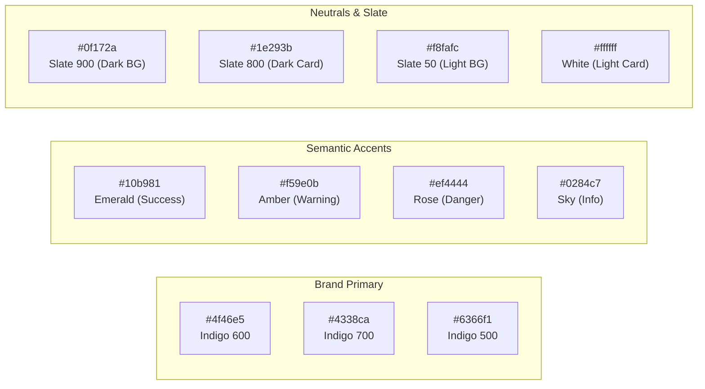
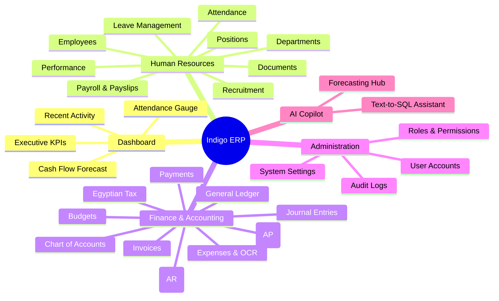
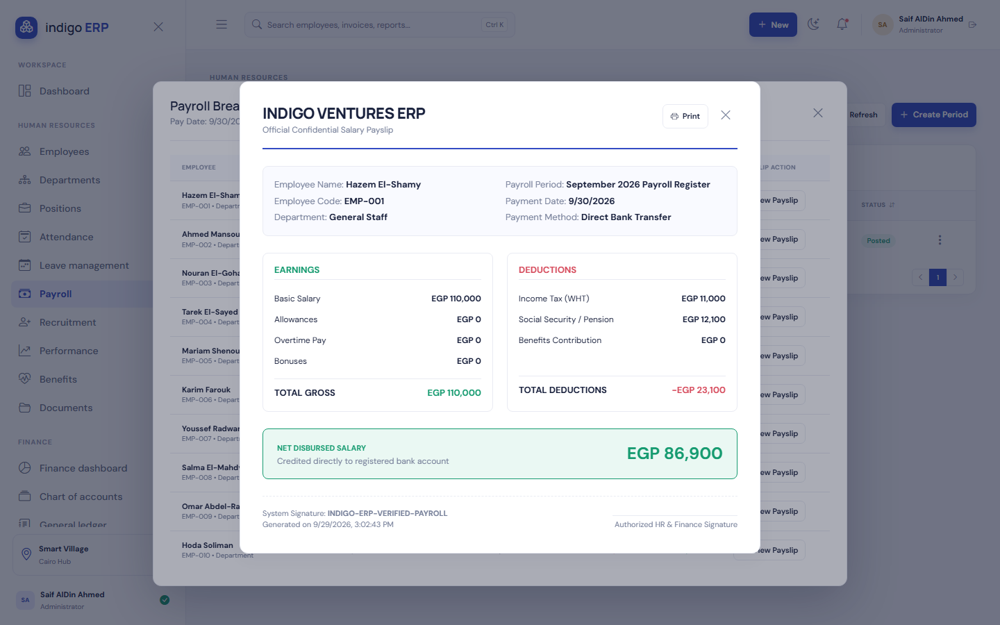
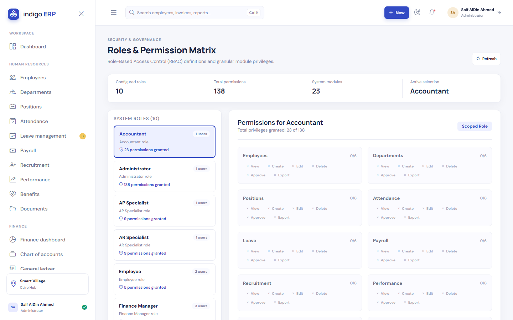
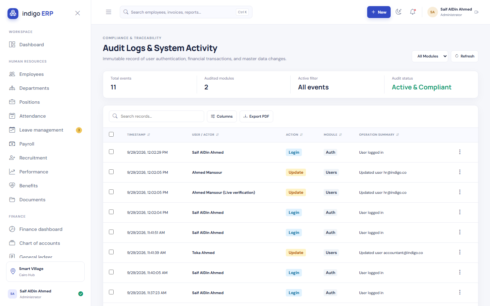
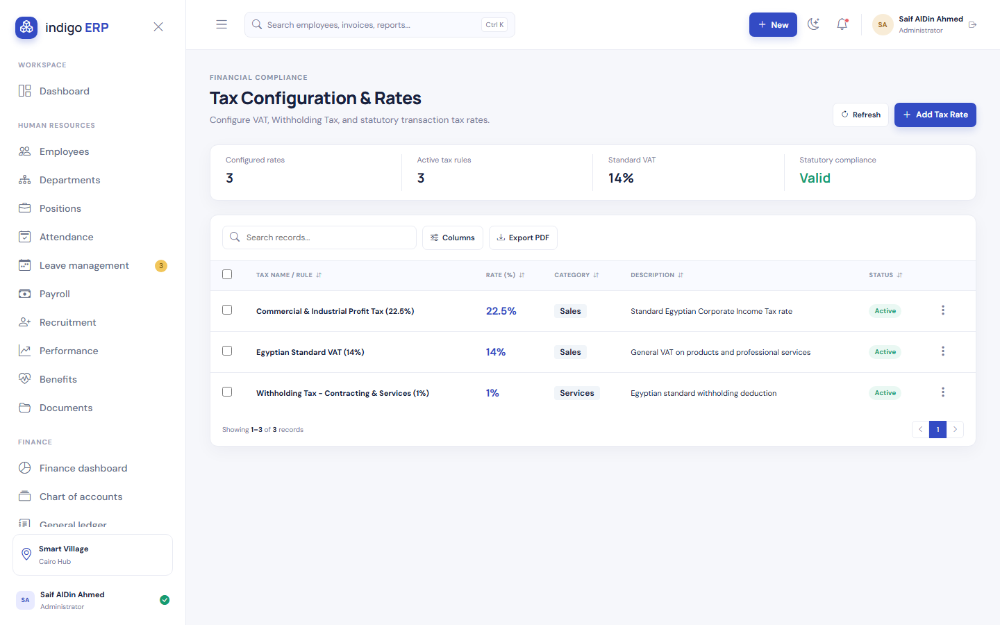

# 🎨 UI/UX Design System & Interface Specifications
## Information Architecture, Design Tokens, Wireframe Specs & Screenshot Gallery
### Enterprise Client: Nile Horizon Technologies S.A.E
**Project Repository:** [Saifahmed3993/ERP-System-with-AI](https://github.com/Saifahmed3993/ERP-System-with-AI)  
**Version:** 2.0.0 — UI/UX Engineering Specification  
**Design Paradigm:** Modern Glassmorphism & High-Density Enterprise SaaS

---

## Table of Contents
1. [Design Philosophy & Aesthetic Standards](#1-design-philosophy--aesthetic-standards)
2. [Design Tokens & Theming System](#2-design-tokens--theming-system)
3. [Information Architecture & Navigation Sitemap](#3-information-architecture--navigation-sitemap)
4. [Component Specifications & Layout Patterns](#4-component-specifications--layout-patterns)
5. [System Screenshot Gallery & Screen Walkthroughs](#5-system-screenshot-gallery--screen-walkthroughs)
   - [5.1 Executive Operations Dashboard](#51-executive-operations-dashboard)
   - [5.2 Financial Reports & Analytics Hub](#52-financial-reports--analytics-hub)
   - [5.3 Confidential Digital Payslip Modal](#53-confidential-digital-payslip-modal)
   - [5.4 Enterprise User Management](#54-enterprise-user-management)
   - [5.5 Role-Based Access Control (RBAC) Matrix](#55-role-based-access-control-rbac-matrix)
   - [5.6 Regulatory Audit Trail Log Viewer](#56-regulatory-audit-trail-log-viewer)
   - [5.7 Organizational & Fiscal Settings](#57-organizational--fiscal-settings)
   - [5.8 Egyptian Tax Rates & VAT Configuration](#58-egyptian-tax-rates--vat-configuration)
6. [Accessibility & Responsive Grid Guidelines](#6-accessibility--responsive-grid-guidelines)

---

## 1. Design Philosophy & Aesthetic Standards

Enterprise ERP systems are traditionally notorious for cluttered, sluggish, and intimidating user interfaces. **Indigo ERP with AI** breaks this pattern by deploying consumer-grade aesthetics tailored for high-efficiency enterprise productivity:

- **Clarity Over Clutter:** Dense information is organized using progressive disclosure, collapsible sidebars, and tabbed sub-views.
- **Immediate Feedback:** Real-time feedback for destructive operations, immediate balance validation on journal vouchers, and live status badges.
- **Dual Visual Themes:** Native **Light Mode** (optimized for brightly lit daytime corporate offices) and **Dark Mode** (engineered with low-contrast eye relief for financial analysts working long hours).

---

## 2. Design Tokens & Theming System

### 2.1 Color Palette Tokens

### 2.2 Typography Scale
- **Primary Font Family:** `Inter`, `-apple-system`, `BlinkMacSystemFont`, `Segoe UI`, `sans-serif`
- **Arabic Font Family:** `Cairo`, `Tajawal`, `IBM Plex Sans Arabic`
- **Scale:**
  * `Display 1`: 32px / Line Height: 1.2 / Font Weight: 700 (Dashboard Titles)
  * `Heading 2`: 24px / Line Height: 1.3 / Font Weight: 600 (Module Headers)
  * `Heading 3`: 18px / Line Height: 1.4 / Font Weight: 600 (Card Titles)
  * `Body Text`: 14px / Line Height: 1.5 / Font Weight: 400 (Table Cells & Forms)
  * `Caption`: 12px / Line Height: 1.4 / Font Weight: 500 (Status Badges, Metadata)

---

## 3. Information Architecture & Navigation Sitemap

---

## 4. Component Specifications & Layout Patterns

1. **Standard Data Table Component:**
   - Real-time client & server-side search input.
   - Column-level multi-sort (ascending / descending).
   - Column visibility toggle menu.
   - Pagination controls (10, 25, 50, 100 rows per page).
   - Export utilities: **Print / PDF** and **Export to Excel (`.xlsx`)** with frozen header row and formatted currency.

2. **Form Layouts & Modal Sheets:**
   - Double-column responsive input grids.
   - Real-time client-side validation badges.
   - Floating action footer with primary action (Right) and dismiss (Left).

---

## 5. System Screenshot Gallery & Screen Walkthroughs

The following high-resolution production captures illustrate the implemented design system:

---

### 5.1 Executive Operations Dashboard
The primary landing workspace aggregating high-level corporate metrics, pending approvals, recent ledger vouchers, and workforce attendance telemetry:

---

### 5.2 Financial Reports & Analytics Hub
A centralized reporting command center providing instant generation of General Ledger statements, Trial Balance, P&L, Egyptian VAT summaries, and AI forecasting trends:

---

### 5.3 Confidential Digital Payslip Modal
The employee and managerial compensation voucher illustrating Egyptian progressive tax withholdings, social insurance splits, allowances, and net EGP disbursement:

---

### 5.4 Enterprise User Management
Administrative portal displaying active user directories, assigned enterprise roles, email identifiers, linked employee profiles, and instant activation toggles:

---

### 5.5 Role-Based Access Control (RBAC) Matrix
The security governance console mapping system roles (Administrator, HR Manager, Finance Manager, Accountant) to fine-grained operational permissions:

---

### 5.6 Regulatory Audit Trail Log Viewer
The immutable historical transaction inspector displaying user mutations, before/after JSON diffs, timestamps, and IP addresses for compliance verification:

---

### 5.7 Organizational & Fiscal Settings
Global enterprise configuration panel defining corporate entity details (Nile Horizon Technologies S.A.E), commercial registration, tax IDs, fiscal calendar, and storage paths:

---

### 5.8 Egyptian Tax Rates & VAT Configuration
The statutory tax engine interface maintaining Egyptian 14% Value Added Tax (VAT), withholding tax brackets, and social insurance contribution ceilings:

---

## 6. Accessibility & Responsive Grid Guidelines

- **WCAG 2.1 AA Compliance:** Minimum color contrast ratio of `4.5:1` for regular text and `3:1` for large headings across both Light and Dark themes.
- **Keyboard Traversal:** Complete keyboard accessibility for table navigation, modal focus trapping, and `Escape` key dismissal.
- **Responsive Breakpoints:**
  * **Desktop Extra-Wide ($> 1440\text{px}$):** Full 4-column KPI cards and expanded side navigation.
  * **Desktop Standard ($1024\text{px} - 1439\text{px}$):** 2-column KPI cards, standard table layouts.
  * **Tablet / Small Laptop ($768\text{px} - 1023\text{px}$):** Collapsible sidebar menu into icon-only mode, horizontally scrollable data tables.

---
*End of UI/UX Design System & Interface Specifications Document*
